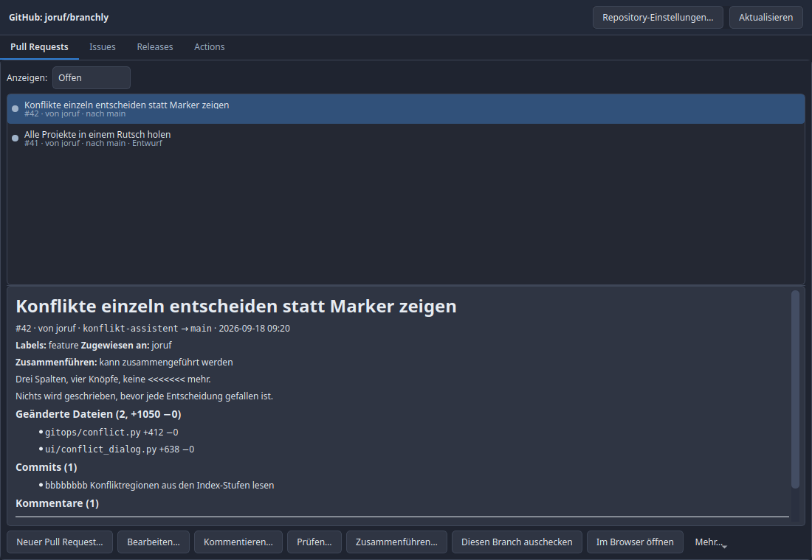

# Branchly

A calm Git client for Linux and Windows: your projects in collapsible categories,
a clear picture of what changed, and merges you can actually understand.

Built because GitHub Desktop has no official Linux build, and because managing a
dozen projects needs categories, favourites and a single glance at "where is
something new" — locally *and* on the server.


## What it does

**Projects, organised**
- Free-form categories you can collapse and expand; the state is remembered
- A star per project pins it to the top of its category
- Sorting: A–Z, Z–A, newest change first, recently opened first, projects with
  changes first, or your own order
- Search across every project, including inside collapsed categories
- Badges per project: local changes, unpushed commits, news on the server,
  conflicts waiting for a decision

**Knowing what is new**
- A background check on a configurable interval (off, 5, 15, 30, 60, 120 minutes)
- Manual check for one project or for all of them, with progress
- The online check uses `git ls-remote`, which asks the server a question and
  changes nothing locally — a background check can never move your refs

**Seeing what changed**
- Side-by-side or single-column, with word-level highlighting inside changed lines
- Side-by-side is two views, not one wide table: both stay visible however narrow
  the panel gets, each has its own horizontal scrollbar, and either one scrolls
  both, because comparing two unrelated places is not comparing
- Whitespace-only changes can be hidden
- Comparison targets: your edits vs. staged, staged vs. last commit, your edits
  vs. last commit, one commit vs. another, one branch vs. another
- Images are shown before/after instead of as unreadable bytes
- Any file opens in your default program, or in its folder

**Everyday Git without the vocabulary**
- Tick the files that belong together, write a summary, save. New changes are
  ticked; whatever you untick stays unticked after a restart, and is forgotten
  once it has been committed
- Right-click a file to ignore it, everything with its extension, or its whole
  folder. The entry is anchored and escaped, so it matches that file and not a
  file that happens to share its name
- Branch: create, switch, rename, delete
- Fetch, pull and push with the counts on the buttons
- One action brings *every* project up to the server's version. Fast-forward only:
  nothing is merged, nothing is overwritten, and every project that was skipped is
  named with the reason — unsaved work, own commits, a waiting conflict
- Graph view with lanes: check out a version, branch from it, merge it,
  cherry-pick, revert, move the branch, tag it, or compare two versions

**Merge conflicts, one decision at a time**


Three columns — your change, the server's, the result — with the reason in plain
words and four buttons. No `<<<<<<<` markers, no "ours" and "theirs", no SHAs.
Nothing is written until every decision is made, and backing out restores exactly
the state from before.

**GitHub, read and write**
- Pull requests: open them, edit them, comment, review (approve, request changes,
  comment), merge with the method of your choice, close, reopen, release a draft.
  A merge sends the commit it believes it is merging, so a push in the meantime
  cancels it instead of merging something you never saw
- Issues: the full list in every state, create, edit, labels, assignees,
  milestones, comments, close as done or as not planned, reopen
- Releases: publish, edit, delete, attach and remove files, and let GitHub write
  the changelog. Deleting a release leaves its tag alone, because a tag someone
  already fetched does not come back by being recreated
- Actions: see the runs and their jobs, start one again, repeat only the failed
  jobs, cancel one that is going, remove an old one
- Repository settings: description, website, topics, default branch, visibility,
  the switches for issues, wiki and boards, archiving. Only what you changed is
  sent
- Create a repository on GitHub and clone it in the same step. Private by default:
  a repository made public by mistake cannot be made unseen
- Delete a repository, behind the only confirmation in this program that asks you
  to type the name, because it is the only action that cannot be undone
- Build status as traffic lights, author avatars, and non-GitHub remotes say so
  plainly instead of showing empty panels
- Labels, milestones and collaborators are managed here too, and a review can
  be requested from anyone who can be assigned
- An action the token may not perform is disabled with the reason, not hidden



**Two languages, two themes**
- German and English; a new language is one JSON file in `locales/`
- Dark and light; a new theme is one entry in `config/theme.py`

**Keeping itself up to date**
- Once a day on startup Branchly asks GitHub whether a newer version exists and
  says so in a strip you can dismiss; Help → “Check for updates…” asks right away
- “Not now” means *now*: the find is remembered, so the strip is back on the next
  start without asking GitHub again, and gone once you installed it
- Every change since your version is listed, not just the newest commit
- An unpushed commit of your own is not an update: `ahead_by` from the compare
  endpoint decides, with `git merge-base` as the fallback
- One button fetches it and restarts. Your projects, settings and token stay as
  they are, and uncommitted changes in Branchly's own folder block the update
  instead of being thrown away
- The startup check can be switched off in Settings → Automatic checks

## Install

Needs Python 3.11+ and Git.

```bash
cd ~/Applications/branchly
./install_dependencies.py      # opens a window: creates .venv, installs the
                               # pinned package versions, offers Qt system libs
./branchly.sh
```

On Windows: `python install_dependencies.py`, then `branchly.bat`.

Use `./install_dependencies.py --cli` for a terminal-only install (scripts, SSH).
You can run the installer again anytime to repair missing or wrong-version
packages; Settings → General also has “Repair dependencies…”.

`python3 run.py` works too: it notices that the dependencies live in `.venv` and
hands itself over to that interpreter. If something is missing, it opens the
installer window instead of printing a traceback.

For a desktop entry on Linux:

```bash
cp resources/branchly.desktop ~/.local/share/applications/
```

## Security

Branchly runs the real `git` binary rather than reimplementing it, which is also
where most of its safety comes from. On top of that:

- **No credentials are stored.** Git operations use your existing Git credential
  helper (libsecret on Linux, Credential Manager on Windows). The GitHub API
  token, the one thing Branchly does keep, goes into the system keychain, never
  into a config file. Without a keychain, the GitHub features stay off.
- **Writing to GitHub is never implicit.** Nothing is created, changed or deleted
  without a click that says so, and every list is read-only until the token says
  the account may write. Deleting a repository asks for its full name, typed out.
- **No shell, ever.** Every Git call is an argument list with `shell=False`, so a
  branch named `feature/x; rm -rf ~` is just a branch name.
- **Remote URLs are validated before Git sees them.** Carriage returns and
  newlines are refused (the shape behind CVE-2025-23040, where a crafted URL
  leaked credentials to another host), as are `ext::` URLs, `--upload-pack=` and
  anything starting with a dash.
- **Ref names are validated** against `git check-ref-format` rules plus a ban on
  leading dashes, so user input cannot turn into an option.
- **`GIT_TERMINAL_PROMPT=0`** so a missing credential fails immediately instead
  of hanging on a prompt nobody can see.
- **Cloning executes nothing.** Submodules are not initialised, and nothing in a
  freshly cloned repository is run.
- **Opening files refuses `.desktop` and similar descriptors**, which describe a
  command rather than hold content, and refuses any path outside the repository.
- **Destructive actions confirm first**, in a sentence saying what gets lost.
  `--force-with-lease` is offered; a plain `--force` push is not.
- **The bulk pull is fast-forward only.** Over twenty projects nobody is watching
  each one, so git is told to refuse anything but a fast-forward: it cannot build a
  merge commit, cannot leave a conflict behind, and cannot move a branch that has
  unsaved work in its tree. Skipped projects are fetched, which touches no file.
- **The update check is anonymous and never installs by itself.** It asks the
  public commits endpoint without your token, so it cannot spend your rate limit
  or leak the token to a redirect. Installing needs a click, refuses to run over
  uncommitted work, and the archive fallback never overwrites `.git`, `.venv`,
  `settings.json` or `repos.json`.

## Development

```bash
.venv/bin/pip install -r requirements-dev.txt
.venv/bin/ruff check .
QT_QPA_PLATFORM=offscreen .venv/bin/python -m unittest discover -s tests -v
QT_QPA_PLATFORM=offscreen .venv/bin/python scripts/generate_screenshots.py
```

The lint rules live in `ruff.toml` and are picked to match what the code already
does rather than to impose a new style. ruff is a development tool and is
deliberately not in `requirements.txt`: installing Branchly must not pull in a
linter.

The suite builds throwaway repositories with their own Git config, so it behaves
the same on a developer machine and on a bare CI runner.

## Documentation

- [`docs/MANUAL.md`](docs/MANUAL.md) — how to use it
- [`docs/TECHNICAL.md`](docs/TECHNICAL.md) — architecture and the reasoning behind it
- [`docs/UI_OVERVIEW.md`](docs/UI_OVERVIEW.md) — what each panel is for

## Licence

MIT. See [`LICENSE`](LICENSE).
