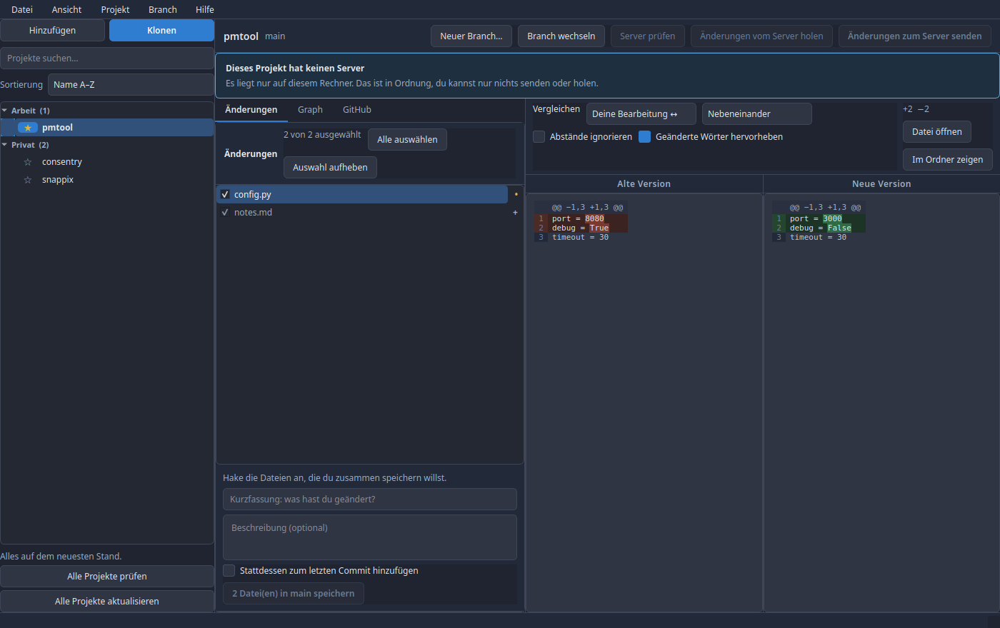
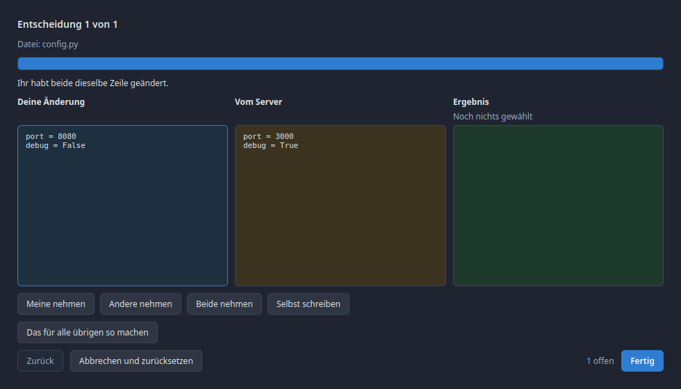

# Branchly

A calm Git client for Linux and Windows: your projects in collapsible categories,
a clear picture of what changed, and merges you can actually understand.

Built because GitHub Desktop has no official Linux build, and because managing a
dozen projects needs categories, favourites and a single glance at "where is
something new" — locally *and* on the server.



## What it does

**Projects, organised**
- Free-form categories you can collapse and expand; the state is remembered
- A star per project pins it to the top of its category
- Sorting: A–Z, Z–A, newest change first, recently opened first, projects with
  changes first, or your own order
- Search across every project, including inside collapsed categories
- Badges per project: local changes, unpushed commits, news on the server,
  conflicts waiting for a decision

**Knowing what is new**
- A background check on a configurable interval (off, 5, 15, 30, 60, 120 minutes)
- Manual check for one project or for all of them, with progress
- The online check uses `git ls-remote`, which asks the server a question and
  changes nothing locally — a background check can never move your refs

**Seeing what changed**
- Side-by-side or single-column, with word-level highlighting inside changed lines
- Whitespace-only changes can be hidden
- Comparison targets: your edits vs. staged, staged vs. last commit, your edits
  vs. last commit, one commit vs. another, one branch vs. another
- Images are shown before/after instead of as unreadable bytes
- Any file opens in your default program, or in its folder

**Everyday Git without the vocabulary**
- Tick the files that belong together, write a summary, save
- Branch: create, switch, rename, delete
- Fetch, pull and push with the counts on the buttons
- Graph view with lanes: check out a version, branch from it, merge it,
  cherry-pick, revert, move the branch, tag it, or compare two versions

**Merge conflicts, one decision at a time**



Three columns — your change, the server's, the result — with the reason in plain
words and four buttons. No `<<<<<<<` markers, no "ours" and "theirs", no SHAs.
Nothing is written until every decision is made, and backing out restores exactly
the state from before.

**GitHub, when it applies**
- Pull requests with build status, check out a PR branch in one click
- Issues, author avatars, CI traffic lights in the graph
- Non-GitHub remotes say so plainly instead of showing empty panels

**Two languages, two themes**
- German and English; a new language is one JSON file in `locales/`
- Dark and light; a new theme is one entry in `config/theme.py`

## Install

Needs Python 3.11+ and Git.

```bash
cd ~/Applications/branchly
./install_dependencies.py      # opens a window: creates .venv, installs the
                               # pinned package versions, offers Qt system libs
./branchly.sh
```

On Windows: `python install_dependencies.py`, then `branchly.bat`.

Use `./install_dependencies.py --cli` for a terminal-only install (scripts, SSH).
You can run the installer again anytime to repair missing or wrong-version
packages; Settings → General also has “Repair dependencies…”.

`python3 run.py` works too: it notices that the dependencies live in `.venv` and
hands itself over to that interpreter. If something is missing, it opens the
installer window instead of printing a traceback.

For a desktop entry on Linux:

```bash
cp resources/branchly.desktop ~/.local/share/applications/
```

## Security

Branchly runs the real `git` binary rather than reimplementing it, which is also
where most of its safety comes from. On top of that:

- **No credentials are stored.** Git operations use your existing Git credential
  helper (libsecret on Linux, Credential Manager on Windows). The GitHub API
  token — the one thing Branchly does keep — goes into the system keychain, never
  into a config file. Without a keychain, the GitHub features stay off.
- **No shell, ever.** Every Git call is an argument list with `shell=False`, so a
  branch named `feature/x; rm -rf ~` is just a branch name.
- **Remote URLs are validated before Git sees them.** Carriage returns and
  newlines are refused (the shape behind CVE-2025-23040, where a crafted URL
  leaked credentials to another host), as are `ext::` URLs, `--upload-pack=` and
  anything starting with a dash.
- **Ref names are validated** against `git check-ref-format` rules plus a ban on
  leading dashes, so user input cannot turn into an option.
- **`GIT_TERMINAL_PROMPT=0`** so a missing credential fails immediately instead
  of hanging on a prompt nobody can see.
- **Cloning executes nothing.** Submodules are not initialised, and nothing in a
  freshly cloned repository is run.
- **Opening files refuses `.desktop` and similar descriptors**, which describe a
  command rather than hold content, and refuses any path outside the repository.
- **Destructive actions confirm first**, in a sentence saying what gets lost.
  `--force-with-lease` is offered; a plain `--force` push is not.

## Development

```bash
QT_QPA_PLATFORM=offscreen .venv/bin/python -m unittest discover -s tests -v
QT_QPA_PLATFORM=offscreen .venv/bin/python scripts/generate_screenshots.py
```

The suite builds throwaway repositories with their own Git config, so it behaves
the same on a developer machine and on a bare CI runner.

## Documentation

- [`docs/MANUAL.md`](docs/MANUAL.md) — how to use it
- [`docs/TECHNICAL.md`](docs/TECHNICAL.md) — architecture and the reasoning behind it
- [`docs/UI_OVERVIEW.md`](docs/UI_OVERVIEW.md) — what each panel is for

## Licence

MIT. See [`LICENSE`](LICENSE).
