# Branchly: Handbuch

Dieses Handbuch beschreibt jede Funktion in der Reihenfolge, in der man ihr im
Programm begegnet. Git-Vorwissen wird nicht vorausgesetzt.

## Wenn du nicht weiterweißt

Fahre mit der Maus über einen Knopf, ein Eingabefeld oder ein Auswahlfeld und
warte einen Moment. Fast alles in Branchly erklärt sich dann selbst: was die
Schaltfläche tut, was sie **nicht** tut, und worauf du achten solltest. Die
Erklärungen sind absichtlich ganze Sätze und keine Wiederholung der Beschriftung.

Ein ausgegrauter Knopf sagt im Tooltip, warum er gerade nicht geht, etwa weil
noch keine Kurzfassung geschrieben ist oder weil ein Pull Request noch ein
Entwurf ist.

## Die drei Bereiche

Links die **Projektliste**, in der Mitte **Änderungen / Graph / Pull Requests**,
rechts die **Gegenüberstellung**. Die Trennlinien lassen sich verschieben; die
Fenstergröße und -position werden beim Beenden gespeichert.

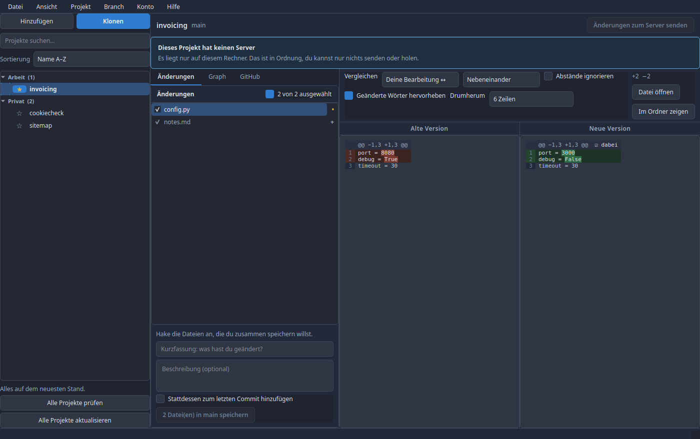

### Fenstergröße

Das Fenster lässt sich auf etwa 930 Pixel Breite ziehen und behält dabei alle
Bedienelemente: die Knopfreihen brechen auf eine zweite Zeile um, statt über den
Rand hinauszulaufen. Das ist nicht nur Bequemlichkeit. Ein Fenster, dessen
Mindestbreite über die Bildschirmbreite hinausgeht, gilt dem Fenstermanager als
nicht veränderbar, und er nimmt ihm dafür den Maximieren-Knopf weg.

Wo Verkleinern, Maximieren und Schließen in der Titelleiste sitzen, links oder
rechts, bestimmt die Desktop-Umgebung, nicht Branchly. Unter Cinnamon steht das
in *Systemeinstellungen → Fenster → Titelleiste*.

### Ausgegraut heißt: geht gerade nicht

Ein Knopf, der im Moment nichts tun kann, ist blass und grau statt farbig. Das
gilt überall, auch für die auffälligen blauen Knöpfe: „Speichern in main" ohne
Kurzfassung sieht aus wie ein Knopf, der wartet, nicht wie einer, der kaputt ist.
Ohne Server hinterlegt gilt dasselbe für Holen und Senden. Der Tooltip sagt in
diesen Fällen, was fehlt.

## Projekte

### Hinzufügen und Klonen

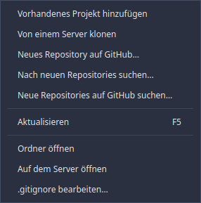

- **Hinzufügen** wählt einen Ordner, in dem schon ein Git-Projekt liegt. Du darfst
  auch einen Unterordner wählen, Branchly findet den obersten Ordner selbst.
- **Klonen** holt ein Projekt von einem Server.

Beim Klonen prüft Branchly die Adresse, während du tippst:

| Meldung | Bedeutung |
|---|---|
| „Diese Adresse lässt sich nicht verwenden" | Tippfehler. Erwartet werden `https://…` oder `git@server:nutzer/projekt.git` |
| „Diese Adresse ist nicht sicher" | Die Adresse enthält Zeichen oder Optionen, mit denen Git etwas anderes täte als verlangt. Branchly verweigert sie |
| „Dieser Ordner ist nicht leer" | Es liegen schon Dateien darin. Klonen ist möglich, siehe unten |
| „Dieser Ordner ist schon ein Git-Projekt" | Hier würde ein Projekt im Projekt entstehen. Nimm „Hinzufügen" |

**Klonen in einen Ordner, in dem schon etwas liegt:** Alles Vorhandene bleibt
erhalten, die Projektdateien kommen daneben. Hätte eine Datei aus dem Projekt
denselben Namen wie eine vorhandene, bricht Git ab und ändert nichts. Du
verlierst also nichts, auch wenn du dich verklickst.

### Einen Ordner ohne Git aufnehmen

Wählst du unter **Hinzufügen** einen Ordner, der noch kein Git-Projekt ist,
bricht Branchly nicht mehr ab, sondern fragt, ob es eines daraus machen soll.
Im Ordner wird dabei nichts verändert: Was schon da ist, wird als noch nicht
gespeichert geführt und wartet auf deinen ersten Commit.

Direkt danach fragt Branchly nach der Adresse des Online-Repositories, also
genau den Dialog aus dem vorigen Abschnitt. Brichst du dort ab, bleibt ein
funktionierendes lokales Projekt zurück, das du jederzeit später verbinden
kannst.

### Alle Projekte auf einmal finden

*Projekt → Nach neuen Repositories suchen…* durchsucht einen Ordner nach
Git-Projekten und listet auf, was es findet. Alles, was noch nicht in Branchly
steht, ist **angehakt**; nimm den Haken weg, was du nicht willst, und klick auf
*Übernehmen*.

Beim allerersten Start mit leerer Projektliste öffnet sich diese Suche von
selbst, denn dann gibt es ohnehin nichts anderes zu sehen. Danach kommt sie nur
noch über das Menü, auch wenn du sie einmal abbrichst.

Was Branchly schon kennt, wird trotzdem mit aufgelistet, mit dem Vermerk *bereits
in Branchly* und ohne Haken. Eine Liste, in der die fehlen, sieht aus, als hätte
die Suche Projekte übersehen, die man in der Seitenleiste sehen kann.

Drei Regeln bestimmen, was gefunden wird:

- **In ein gefundenes Projekt wird nicht hineingesucht.** Sonst tauchten
  Submodule und mitgelieferte Fremdprojekte als eigene Einträge auf.
- **Ordner wie `node_modules`, `.venv` oder `.cache` werden übersprungen.** Dort
  liegt nie ein eigenes Projekt, und sie kosten den Großteil der Zeit.
- **Es wird einige Ebenen tief gesucht, nicht beliebig.** Ein Repository zwanzig
  Ebenen unterhalb ist eine Kopie, kein Projekt.

Die Suche liest nur. Auf der Festplatte wird nichts angelegt, verschoben oder
verändert, und ein Ordner ohne Leseberechtigung wird stillschweigend übergangen.

Über *Einsortieren unter* landen alle übernommenen Projekte gleich in einer
Kategorie.

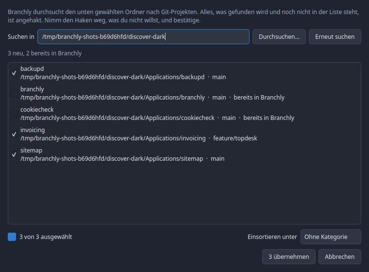

Der Haken über der Liste steht für alle Zeilen, wie unter *Änderungen*: ein Klick
hakt alles an oder ab, halb angehakt heißt, ein Teil ist ausgewählt.

### Neue Repositories auf GitHub finden

*Projekt → Neue Repositories auf GitHub suchen…* listet die Repositories deines
GitHub-Kontos, die Branchly noch nicht kennt. Archivierte Repositories und Forks
bleiben draußen. Ohne Anmeldung fragt Branchly zuerst, ob du dich anmelden willst.

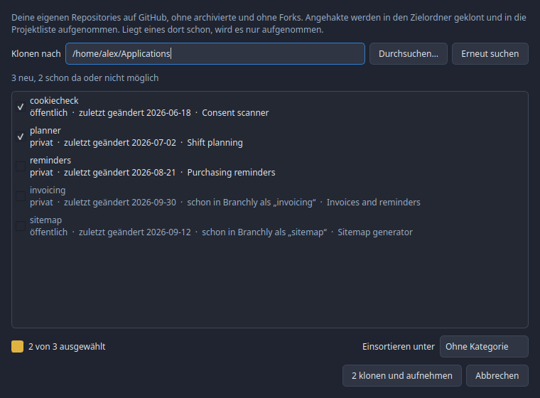

Oben steht der Zielordner. Vorgeschlagen ist der Ordner, in dem die meisten deiner
Projekte liegen, danach der zuletzt gewählte. Jedes Repository kommt in einen
Unterordner mit seinem Namen. Was in der Liste steht:

| Steht da | Heißt |
|---|---|
| *privat* oder *öffentlich*, *zuletzt geändert …* | Neu, angehakt: wird geklont und aufgenommen |
| *liegt schon unter …, wird nur aufgenommen* | Der Ordner ist schon ein Klon davon, Branchly kannte ihn nur nicht |
| *schon in Branchly als „…“* | Grau, es gibt nichts zu tun. Auch ein umbenanntes Repository wird erkannt |
| *… gibt es schon und ist etwas anderes* | Grau: dort liegt ein anderes Projekt oder ein normaler Ordner |

**Klonen und aufnehmen** arbeitet die angehakten Zeilen nacheinander ab, jede
Zeile meldet, wie es lief. Private Repositories werden mit deiner Anmeldung bei
GitHub geklont. Über *Einsortieren unter* landen alle in einer Kategorie.
**Abbrechen** beendet den laufenden Klon, schon fertige Projekte bleiben.

### Kategorien

Rechtsklick in die Liste oder auf eine Kategorie:

- **Neue Kategorie** anlegen
- **In Kategorie verschieben**, auch direkt in eine neu angelegte
- **Umbenennen**, die Projekte wandern mit
- **Entfernen**: die Projekte bleiben, sie landen unter „Ohne Kategorie"
- **Alle auf-/zuklappen**

Der Zustand jeder Kategorie wird gespeichert. Eine **Suche zeigt auch Treffer in
zugeklappten Kategorien**, sonst wäre nicht nachvollziehbar, warum ein Projekt
fehlt.

### Ein verschobenes Projekt wiederfinden

Wurde der Ordner eines Projekts verschoben oder umbenannt, steht sein Name rot in der
Liste und oben erscheint „Ordner nicht mehr gefunden". Ein Rechtsklick auf das
Projekt bietet dann als ersten Eintrag **Pfad anpassen…** an. Die Auswahl öffnet
im nächsten Ordner, den es noch gibt, und du zeigst auf den neuen Ort. Ein
Unterordner genügt, Branchly findet den obersten Ordner selbst.

Erhalten bleiben Kategorie, Sternchen, eigene Reihenfolge, die abgewählten Dateien
und ein selbst vergebener Name. Hieß das Projekt nur wie sein alter Ordner,
bekommt es den Namen des neuen. Branchly prüft die Wahl:

| Fall | Was passiert |
|---|---|
| Dort liegt kein Git-Projekt | Hinweis, nichts ändert sich |
| Der Ordner steht schon in der Liste | Hinweis mit dem Namen des anderen Eintrags |
| Das gewählte Projekt hat eine andere Server-Adresse | Rückfrage, denn es ist vielleicht ein anderes Projekt |

### Sternchen und Sortierung

Das Sternchen links neben dem Namen heftet ein Projekt **innerhalb seiner
Kategorie** nach oben. Das gilt in jeder Sortierung, dafür ist es da.

Sortierungen: Name A–Z, Name Z–A, neueste Änderung zuerst, zuletzt geöffnet
zuerst, eigene Reihenfolge.

Darunter steht der Haken **Projekte mit Änderungen zuerst**. Er kommt zur
gewählten Sortierung hinzu, statt sie zu ersetzen: oben stehen Projekte mit
Konflikten, dann mit ungespeicherter Arbeit, dann mit Commits, die gesendet oder
geholt werden wollen, danach der Rest. Innerhalb jeder dieser Gruppen gilt die
Sortierung aus der Auswahlliste. Mit *Name A–Z* und Haken stehen also alle
Projekte mit Änderungen alphabetisch oben, die übrigen alphabetisch darunter.
Favoriten bleiben auch hier zuerst.

### Die Badges

| Badge | Bedeutung |
|---|---|
| `!` rot | Konflikt, eine Entscheidung fehlt |
| `●` gelb | Geänderte Dateien im Projekt |
| `↓` blau | Auf dem Server liegt Neues |
| `↑` gelb | Commits, die noch nicht gesendet sind |
| `!` allein | Der Ordner ist verschwunden |

Unter der Liste steht die Zusammenfassung über alle Projekte, z. B.
„2 Projekte mit Änderungen · 1 Projekt mit Neuigkeiten vom Server".

### Was der Tooltip verrät

Mit der Maus auf einer Zeile stehen bleiben, und es erscheint ein kleiner
Kasten mit den beiden Angaben, die in die Zeile nicht hineinpassen:

| Zeile | Inhalt |
|---|---|
| Im Netz | Die Adresse des Repositories auf dem Server, oder „Kein Server hinterlegt" |
| Lokale Kopie | Der vollständige Pfad des Ordners auf dieser Festplatte |

Darunter steht, wann das Projekt zuletzt geprüft wurde, bei einem verschwundenen
Ordner stattdessen der Hinweis darauf. Das Ganze gilt für die ganze Zeile, nicht
nur für den Namen.

## Prüfen, was neu ist

Von selbst aktualisiert Branchly in diesen Fällen:

| Wann | Was |
| --- | --- |
| Du gibst dem Fenster den Fokus | Das ausgewählte Projekt wird neu gelesen, samt Dateiliste, Gegenüberstellung und Badges |
| Du wählst links ein anderes Projekt | Dieses Projekt wird gelesen und geprüft |
| Nach dem eingestellten Intervall | Alle Projekte |
| Kurz nach dem Start | Alle Projekte |

Der Fokus-Fall ist der wichtigste im Alltag: du änderst Dateien in deinem Editor,
klickst zurück auf Branchly, und was du siehst, ist das, was auf der Festplatte
steht. Ohne das müsstest du jedes Mal von Hand aktualisieren.

Damit daraus kein Dauerfeuer wird, greift das höchstens alle zwei Sekunden.
Zwischen Editor und Branchly hin und her zu springen löst also nicht bei jedem
Sprung eine Runde aus. Wanderst du mit den Pfeiltasten durch die Projektliste,
wird ebenfalls nur das Projekt geprüft, auf dem du stehen bleibst, nicht jedes
auf dem Weg dorthin.

Die GitHub-Daten werden beim Fokuswechsel **nicht** neu geholt. Das wären
Netzanfragen gegen ein Limit, für Daten, die sich in Minuten statt in Sekunden
ändern. Dafür gibt es den Knopf *Aktualisieren* im GitHub-Reiter.

Von Hand geht es weiterhin so:

- **Alle Projekte prüfen** unten in der Liste, direkt über *Alle Projekte
  aktualisieren*. Beide stehen nur dort und nicht zusätzlich im Menü
- **Dieses Projekt jetzt prüfen** im Rechtsklickmenü
- **Automatisch** in Einstellungen → Automatische Prüfung: aus, 5, 15, 30, 60
  oder 120 Minuten

Die Online-Prüfung fragt den Server nur, welche Stände er hat. Sie lädt nichts
herunter und verändert dein Projekt nicht. Wer ganz ohne Netz arbeiten will,
schaltet „Auch die Server fragen" aus; dann werden nur die lokalen Ordner
angesehen.

## Alle Projekte auf einmal aktualisieren

**Alle Projekte aktualisieren** unten in der Liste holt für jedes Projekt die
Änderungen vom Server. Das Fenster beginnt sofort, eine zweite Bestätigung gibt
es nicht. Es zeigt den Fortschritt und danach für **jedes** Projekt einzeln, was
daraus geworden ist.

Das Fenster ist zweigeteilt. Zu Beginn stehen alle Projekte links. Bekommt ein
Projekt tatsächlich neue Commits, springt es nach rechts unter **Aktualisiert**,
mit seiner Farbe. Links bleibt, was schon aktuell war, übersprungen wurde oder
nicht ging: genau dort lohnt sich der zweite Blick.

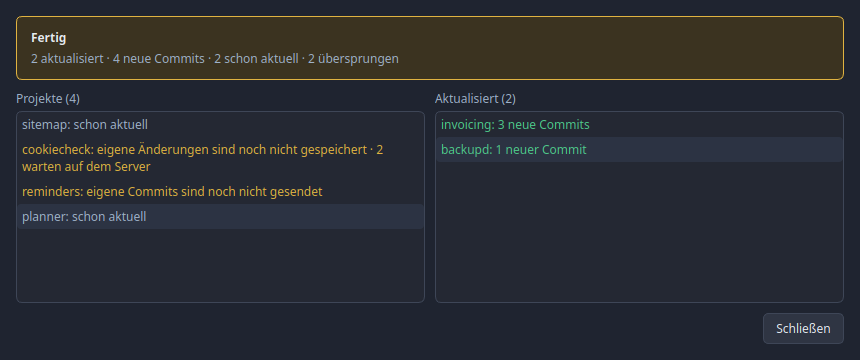

Der Vorgang **spult nur vor**. Er führt nichts zusammen, überschreibt nichts und
kann keinen Konflikt hinterlassen. Was nicht eindeutig vorzuspulen ist, bleibt
unangetastet und steht namentlich in der Liste:

| Steht da | Heißt |
|---|---|
| *3 neue Commits* | Vorgespult, das Projekt ist auf dem Stand des Servers |
| *schon aktuell* | Der Server hatte nichts Neues |
| *eigene Änderungen sind noch nicht gespeichert* | Im Ordner liegt unfertige Arbeit |
| *eigene Commits sind noch nicht gesendet* | Der Branch ist auseinandergelaufen, Vorspulen ist unmöglich |
| *Konflikte warten auf eine Entscheidung* | Erst den Konflikt-Assistenten durchlaufen |
| *kein Branch ausgewählt* | Detached HEAD |
| *der Branch folgt keinem Server-Branch* | Kein Upstream gesetzt |
| *kein Server* | Rein lokales Projekt |

Übersprungene Projekte werden trotzdem **geholt** (`fetch`). Das rührt den Ordner
nicht an, sorgt aber dafür, dass hinterher „3 warten auf dem Server" dasteht statt
eines veralteten Badges. Ein solches Projekt aktualisierst du danach einzeln über
**Änderungen vom Server holen**: dort führt Branchly bei Bedarf zusammen und
öffnet den Konflikt-Assistenten.

Während der Lauf arbeitet, wartet der Knopf **Schließen**: der Lauf schreibt in
die Ordner, und ein halb fertiges Projekt ohne jemanden, der zusieht, wäre die
schlechtere Variante. Sobald alles durch ist, schließt er das Fenster.

Von Haus aus schließt sich das Fenster nach dem Lauf **von selbst**, nach einem
kurzen Moment zum Hinsehen. Das Ergebnis steht danach oben im Hauptfenster,
übersprungene oder fehlgeschlagene Projekte gehen also nicht verloren. Wer das
Fenster lieber selbst schließt, nimmt in den Einstellungen unter *Allgemein* den
Haken bei *Fenster „Alle Projekte aktualisieren“ nach dem Abgleich selbst
schließen* heraus. Das gilt auch für das Senden aller Projekte.

## Alle Projekte auf einmal senden

Das Gegenstück steht im Menü **Branch → Alle Änderungen zum Server senden…**, direkt unter dem Eintrag für das einzelne Projekt. Es
sendet in jedem Projekt die Commits, die noch nicht auf dem Server sind, im selben
Fenster und ebenfalls ohne zweite Bestätigung.

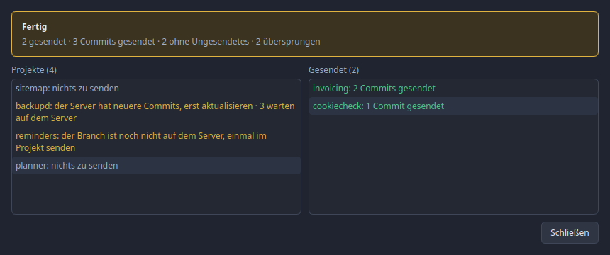

Wie beim Aktualisieren springt ein Projekt nach rechts, hier unter **Gesendet**,
sobald seine Commits auf dem Server sind.

Gesendet wird nur, was sich einfach senden lässt. Nichts wird erzwungen:

| Steht da | Heißt |
|---|---|
| *2 Commits gesendet* | Der Server hat jetzt alles |
| *nichts zu senden* | Es lag nichts Ungesendetes vor |
| *der Server hat neuere Commits, erst aktualisieren* | Jemand anderes hat gesendet. Erst holen, dann senden |
| *der Branch ist noch nicht auf dem Server, einmal im Projekt senden* | Ein neuer Branch wird nicht nebenbei veröffentlicht |
| *Konflikte warten auf eine Entscheidung*, *kein Branch ausgewählt*, *kein Server* | Wie beim Aktualisieren |

Ungespeicherte Änderungen im Ordner stören nicht, denn gesendet werden Commits,
keine Dateien.

## Änderungen speichern

1. Dateien anhaken, die zusammengehören
2. Kurzfassung schreiben (Pflicht), Beschreibung optional
3. **„n Datei(en) in <branch> speichern"**

Kurzfassung, Beschreibung und der Haken *Stattdessen zum letzten Commit hinzufügen* gehören zum
Projekt. Wer zwischendurch ein anderes Projekt anklickt, findet beim Zurückkommen
alles wieder so vor, wie es war, und im anderen Projekt steht nichts davon. Das
hält Branchly nur, solange es läuft. Nach dem Commit ist das Feld wieder leer.

Über der Liste steht ein einzelner Haken, der für alle steht. Er trägt die Zahl
als eigene Beschriftung, du kannst also die ganze Zeile anklicken, und er zeigt
mit seinem Aussehen, woran du gerade bist:

| Aussehen | Bedeutung |
|---|---|
| Blau angehakt | Alles kommt in den Commit. So fängt es an |
| Gelb halb gefüllt | Ein Teil ist draußen, entweder eine ganze Datei oder ein einzelner Block |
| Leer | Nichts ist ausgewählt |

Ein Klick nimmt alles heraus, der nächste legt alles zurück. Steht der Haken auf
halb, macht ein Klick daraus wieder **alles**, samt der Blöcke, die du einzeln
abgewählt hattest. Ein Haken, der etwas anderes sagt, als der Commit tut, wäre
schlimmer als keiner.

„Stattdessen zum letzten Commit hinzufügen" hängt die Auswahl an den vorherigen
Commit, statt einen neuen anzulegen.

### Nur einzelne Blöcke committen

Manchmal stecken in einer Datei zwei Dinge, die nicht in denselben Commit
gehören. Über jedem Block in der Gegenüberstellung steht deshalb ein Häkchen:

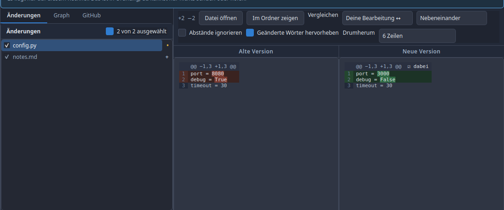

| Anzeige | Bedeutung |
|---|---|
| ☑ dabei | Der Block kommt in den nächsten Commit |
| ☐ draußen | Der Block bleibt liegen, blass dargestellt |

Ein Klick auf das Häkchen schaltet um. Nimmst du etwas heraus, steht der Haken
der Datei in der Liste links auf halb, und Branchly speichert beim Commit genau
die Blöcke, die dabei sind. Was draußen bleibt, steht danach unverändert auf
deiner Festplatte und taucht als Änderung wieder auf.

Zwei Grenzen, beide mit Absicht:

- Die Häkchen gibt es nur beim Vergleich **Deine Bearbeitung ↔ letzter Stand**.
  Zwei Commits gegeneinander lassen sich nicht in einen neuen Commit verwandeln.
- Ein Klick auf den Haken der ganzen Datei hebt die Blockauswahl wieder auf. Ein
  Haken, der etwas anderes sagt als der Commit tut, wäre schlimmer als keiner.

### Die Auswahl bleibt erhalten

Neue Änderungen sind immer angehakt. Nimmst du einen Haken weg, merkt Branchly
sich das: nach dem Schließen und Öffnen ist die Datei wieder abgewählt. Gemerkt
wird nur, was du abgewählt hast, nicht was angehakt ist, denn alles andere ist
ohnehin dabei und eine frisch geänderte Datei soll nicht erst gesucht werden
müssen.

Die Merkung überlebt auch, dass die Datei zwischendurch aus der Liste
verschwindet, etwa weil du die Änderung verworfen hast und später erneut
dieselbe Datei anfasst.

Sobald eine Datei in einem Commit gelandet ist, ist die Sache erledigt und
Branchly vergisst sie. Eine spätere, ganz andere Änderung an derselben Datei ist
also wieder angehakt.

### Was in der Liste steht

Rechts an jeder Zeile steht ein Zeichen, das sagt, was mit der Datei passiert ist,
genau wie in GitHub Desktop:

| Zeichen | Bedeutung |
| --- | --- |
| `+` | neu angelegt, git kannte sie vorher nicht |
| `•` | ersetzt, es gab sie schon |
| `−` | gelöscht |
| `→` | umbenannt oder verschoben |
| `!` | Konflikt, muss erst entschieden werden |

Die Farbe der Zeile sagt dasselbe noch einmal, damit es auch erkennbar bleibt,
wenn die Zeichen schwer zu unterscheiden sind.

### Rechtsklick auf eine Datei

**Datei öffnen** (Standardprogramm), **Im Ordner zeigen**, **Pfad kopieren**,
**Ignorieren…**, **Änderungen verwerfen**. Verwerfen fragt vorher nach und lässt
sich nicht rückgängig machen.

### Ignorieren

Unter **Ignorieren…** stehen bis zu drei Einträge, je nachdem, worauf du geklickt
hast:

| Eintrag | Schreibt nach `.gitignore` |
| --- | --- |
| Nur diese Datei | `/pfad/zur/datei.txt` |
| Alle `*.log`-Dateien | `*.log` |
| Den ganzen Ordner `build/` | `/build/` |

Der Eintrag für eine einzelne Datei bekommt einen führenden Schrägstrich. Ohne
ihn würde `notizen.txt` auch `doku/notizen.txt` treffen, und gemeint war die eine
Zeile, auf die du geklickt hast. Sonderzeichen im Dateinamen (`*`, `?`, `[`, ein
führendes `#`) werden maskiert, damit der Eintrag genau diese Datei trifft und
keine andere.

`.gitignore` wird angelegt, falls es sie noch nicht gibt, sonst wird unten
angehängt. Steht der Eintrag schon drin, sagt Branchly das und schreibt nichts
doppelt.

Eine Datei, die bereits unter Versionskontrolle steht, verschwindet dadurch
**nicht**. `.gitignore` gilt nur für Dateien, die git noch nicht kennt. Der
Eintrag wird trotzdem geschrieben, damit er greift, sobald die Datei aus der
Versionskontrolle genommen wird.

### Rechtsklick auf eine leere Fläche

Ein Rechtsklick unterhalb der Dateien, oder auf den Hinweis, wenn ein Projekt
gar keine Änderungen hat, öffnet ein Menü für das Projekt als Ganzes:

- **.gitignore bearbeiten…** öffnet die Datei in einem eigenen Fenster
- **Ordner öffnen**
- **Aktualisieren**
- **Alle Änderungen zurücksetzen…**, ausgegraut, wenn es nichts zurückzusetzen gibt

Dasselbe Fenster öffnet auch das Menü **Projekt → .gitignore bearbeiten…**, immer
für das links ausgewählte Projekt. Ist keines ausgewählt, ist der Eintrag
ausgegraut.

Im Fenster steht die `.gitignore` als Text, ein Muster pro Zeile. Kommentare,
Leerzeilen und die Reihenfolge bleiben genau so, wie du sie schreibst, und eine
Datei mit Windows-Zeilenenden wird mit Windows-Zeilenenden zurückgeschrieben.
Gibt es noch keine, legt *Speichern* sie an. Leerst du das Feld ganz, wird die
Datei entfernt. *Speichern* bleibt grau, bis du etwas geändert hast, und wer mit
ungespeicherten Änderungen abbricht, wird gefragt.

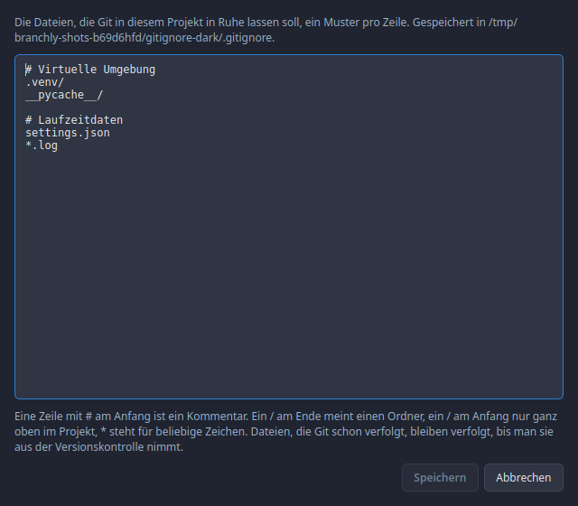

Eine `.gitignore`, die sich nicht lesen lässt, wird gesperrt angezeigt und nie
überschrieben.

Neue Ordner, die Git noch nicht kennt, stehen in der Liste übrigens Datei für
Datei und nicht als ein einzelner Eintrag. Nur so lässt sich jede davon anhaken,
vergleichen oder einzeln ignorieren.

## Gegenüberstellung

Zwei Einstellungen, unabhängig voneinander:


**Darstellung**: Nebeneinander oder Eine Spalte, „Abstände ignorieren",
„Geänderte Wörter hervorheben", „Unveränderten Text zeigen".

**Drumherum** ist die Ausklappliste, die bestimmt, wie viel unveränderter Text um
jede Änderung herum zu sehen ist: 3, 6, 10, 20 oder 50 Zeilen, oder **die ganze
Datei**. Voreingestellt sind sechs. Git selbst zeigt drei, was reicht, um eine
Änderung einzuordnen, aber nicht, um sie im Zusammenhang zu lesen.

Dieser Text steht in einem ruhigen Grau, gut lesbar, aber deutlich
zurückgenommen, damit die Änderung selbst das Auffällige bleibt.

#### Der Änderungsbalken

Zeigst du die ganze Datei, erscheint zwischen *Alte Version* und *Neue Version*
ein schmaler senkrechter Balken. Er stellt die **komplette Datei** dar, von oben
nach unten, und markiert jede Stelle, an der sich etwas geändert hat:

| Farbe | Bedeutung |
|---|---|
| Grün | Dort wurde etwas hinzugefügt |
| Rot | Dort wurde etwas gelöscht |
| Gelb | Dort steckt beides, eine Zeile wurde ersetzt |

Ein Klick auf eine Markierung springt genau an diese Stelle, in beiden Spalten
gleichzeitig. Bei einer Datei mit tausend Zeilen und drei Änderungen musst du
also nicht mehr suchen. Der helle Rahmen im Balken zeigt, welcher Ausschnitt
gerade auf dem Schirm ist.

Triffst du die Markierung nicht genau, springt Branchly zur nächstgelegenen.
Eine einzelne geänderte Zeile in einer langen Datei ist nur wenige Pixel hoch,
und darauf zielen zu müssen wäre keine Hilfe.

In der einspaltigen Ansicht sitzt derselbe Balken rechts neben dem Text.

Bei **Nebeneinander** stehen zwei getrennte Ansichten: links der alte Stand,
rechts der neue. Über jeder der beiden steht, welche sie ist, nämlich „Alte
Version" und „Neue Version". Ohne diese Beschriftung lässt sich links und rechts
verwechseln, und dann liest man jede Hinzufügung als Löschung. Die Beschriftung
bleibt beim Scrollen stehen. Beide bleiben sichtbar, auch wenn der Platz knapp wird; keine
der beiden Seiten verschwindet oder wird zusammengeschoben. Jede Seite hat einen
eigenen waagerechten Scrollbalken für lange Zeilen, und beide sind gekoppelt:
egal welchen du benutzt, es scrollen immer beide Seiten mit, sonst würdest du
zwei Stellen vergleichen, die nichts miteinander zu tun haben. Senkrecht
scrollen beide ebenfalls gemeinsam, damit die Zeilen auf gleicher Höhe bleiben.

Die Trennlinie zwischen den beiden Seiten lässt sich ziehen, wenn eine Seite mehr
Platz braucht als die andere.

**Vergleichen**: was gegen was gehalten wird:

| Auswahl | Vergleicht |
|---|---|
| Deine Bearbeitung ↔ letzter Stand | Der übliche Fall |
| Deine Bearbeitung ↔ bereit zum Speichern | Was noch nicht angehakt wirkt |
| Bereit zum Speichern ↔ letzter Stand | Was der nächste Commit enthält |
| Zwei ausgewählte Stände | Im Graph zwei Commits markieren |
| Zwei Branches | Zwei Zweige vollständig |

### Dateien ohne Zeilen

Nicht jede Datei besteht aus Zeilen, die sich vergleichen lassen. Gegenübergestellt
werden sie trotzdem, denn eine neue Fassung ist eine Änderung, und „das ist keine
Textdatei" sagt darüber nichts aus.

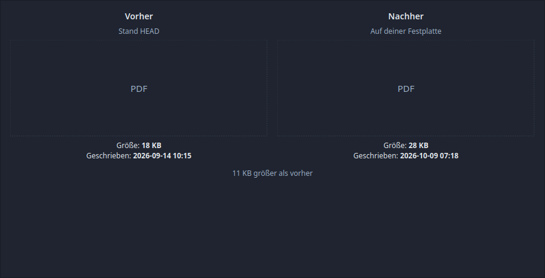

**Bilder** stehen als Vorher und Nachher nebeneinander, beide auf Fenstergröße
verkleinert, wenn sie zu groß sind.

**Alles andere** bekommt statt des Bildes ein Feld mit dem Dateityp, und darunter
stehen auf beiden Seiten die zwei Angaben, die es zu jeder Datei gibt: **Größe**
und **wann sie geschrieben wurde**. Darunter steht in einem Satz, was sich
geändert hat, etwa „11 KB größer als vorher".

Woher das Datum kommt, hängt von der Seite ab:

| Seite | Größe | Datum |
| --- | --- | --- |
| Auf deiner Festplatte | die echte Dateigröße | wann die Datei zuletzt geschrieben wurde |
| Ein Commit | die Größe im Repository | das Datum des Commits, der die Datei zuletzt geändert hat |
| Bereit zum Speichern | die Größe im Index | wann die Datei beim Bereitstellen geschrieben wurde |

Lässt sich ein Datum nicht ermitteln, steht dort ein Strich. Ein erfundenes Datum
in einer Gegenüberstellung wäre schlimmer als gar keins.

Eine Seite, die es nicht gibt, sagt das ausdrücklich: eine gerade erst angelegte
Datei hat kein „Vorher", und das ist eine Information, keine Lücke.

Sehr große Diffs werden gekürzt, mit Hinweis. Bei einem sehr großen Bild wird die
Vorschau ausgelassen, die Größe und das Datum stehen trotzdem da.

## Graph

Jede Linie ist ein Branch, jeder Punkt ein gespeicherter Stand, der neueste oben.
Der Ring markiert, wo du stehst. In Klammern stehen Branch- und Tag-Namen.

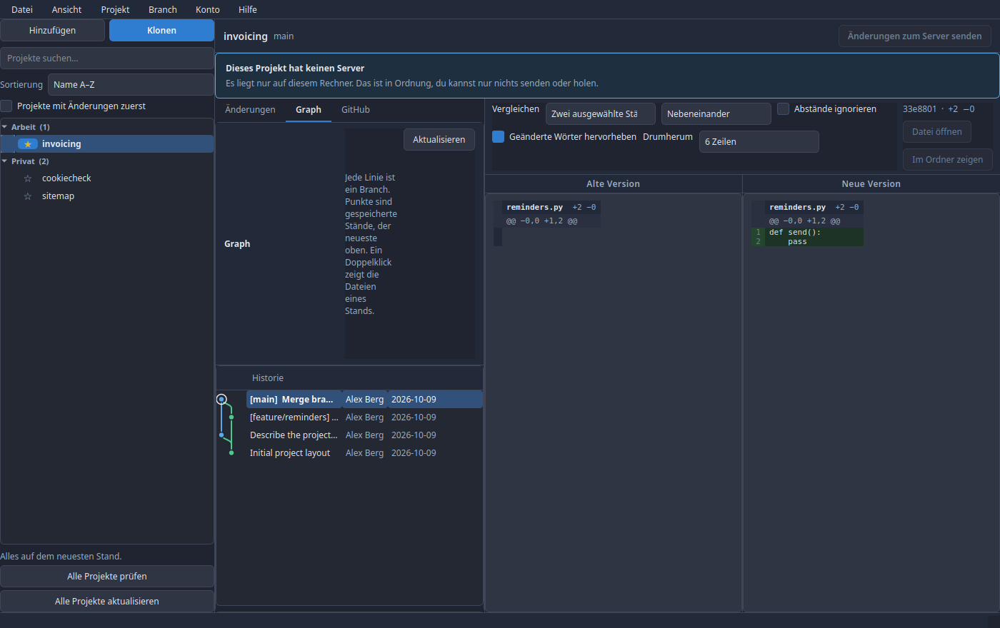

Ein Klick zeigt rechts **alle Änderungen dieses Commits**. Rechtsklick:

| Aktion | Wirkung |
|---|---|
| Diesen Stand ansehen | Springt zu diesem Stand. Branchly erklärt vorher, dass dabei kein Branch aktiv ist, und bietet an, stattdessen einen anzulegen |
| Hier einen neuen Branch beginnen | Neuer Branch ab diesem Stand |
| In `<branch>` zusammenführen | Merge in den aktuellen Branch |
| Diese Änderung auf `<branch>` übernehmen | Cherry-pick |
| Diese Änderung rückgängig machen | Neuer Commit, der zurücknimmt. Der alte bleibt in der Historie |
| Branch hierher setzen… | Drei Varianten: alles behalten, Dateien behalten, oder **meine Arbeit wegwerfen** |
| Diesem Stand einen Namen geben | Tag |
| Stand-Kennung kopieren | SHA in die Zwischenablage |
| Zum Vergleich markieren | Danach an einem zweiten Commit „Mit dem markierten Stand vergleichen" |

„Branch hierher setzen und meine Arbeit wegwerfen" ist die einzige Aktion, die
Arbeit endgültig vernichtet. Sie fragt in klaren Worten nach.

### Dateien eines Stands und alte Versionen

Ein **Doppelklick** auf einen Stand (oder Rechtsklick, *Dateien dieses Stands…*)
öffnet ein Fenster mit allen Dateien, die dieser Stand geändert hat. Links steht
die Liste mit Haken, rechts die Änderung der Datei, auf der du gerade stehst.

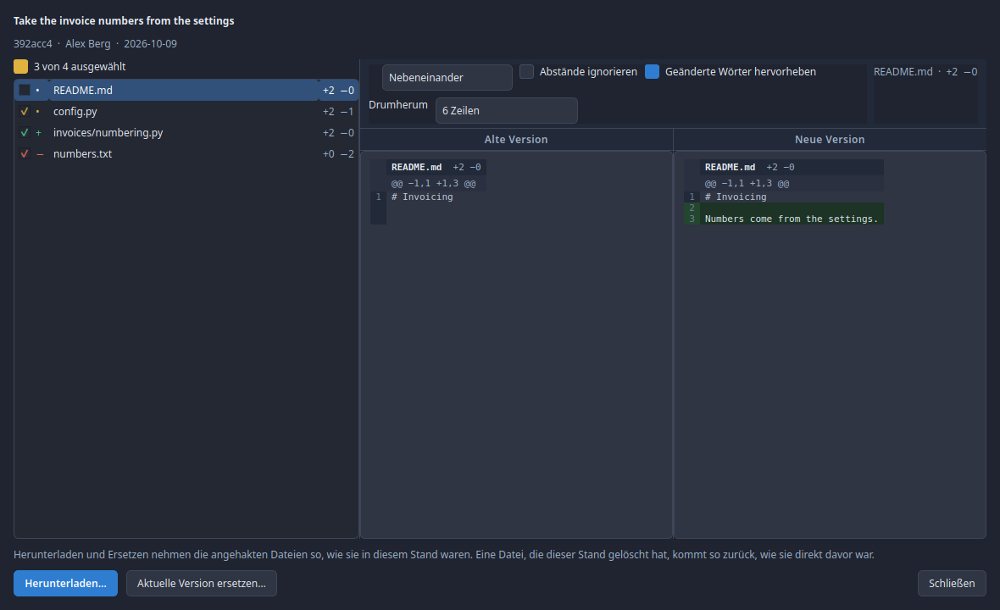

Alle Dateien sind angehakt. Der Haken über der Liste funktioniert wie unter
*Änderungen*: ein Klick hakt alles an oder ab, halb angehakt heißt, ein Teil ist
ausgewählt. Unten stehen zwei Aktionen, beide gelten für die angehakten Dateien:

| Aktion | Wirkung |
|---|---|
| **Herunterladen…** | Fragt nach einem Ordner (beim ersten Mal *Downloads*, danach der zuletzt gewählte) und legt dort einen neuen Ordner `<projekt>-<stand>` an, z. B. `invoicing-4dda86e`, mit den Unterordnern des Projekts. Am Projekt ändert sich nichts. Oben erscheint, wohin gespeichert wurde, mit **Ordner öffnen** |
| **Aktuelle Version ersetzen…** | Setzt die Dateien im Projektordner auf ihre Version aus diesem Stand, nach einer Rückfrage |

Beide nehmen die Datei so, wie sie **in diesem Stand** war, also nach dem
Commit. Eine Datei, die dieser Stand gelöscht hat, kommt so zurück, wie sie
direkt davor war. Ein zweites Herunterladen desselben Stands landet in
`…-2`, das erste bleibt unangetastet.

Vor dem Ersetzen listet Branchly jede betroffene Datei auf:

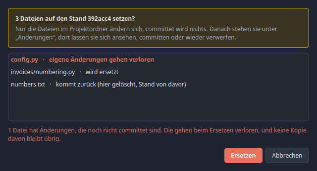

Dateien mit **Änderungen, die noch nicht committet sind**, stehen oben und rot:
deren aktueller Inhalt ist nirgends gesichert und geht verloren. Das gilt auch
für eine Datei, die auf der Festplatte liegt, aber nicht von Git verfolgt wird.

Ersetzt wird nur im Projektordner, committet wird nichts. Danach wechselt
Branchly zu *Änderungen*, dort stehen die ersetzten Dateien wie jede andere
Änderung: ansehen, committen oder wieder verwerfen.

## Konflikte auflösen

Wenn beim Holen oder Zusammenführen dieselben Stellen von beiden Seiten geändert
wurden, erscheint oben ein Hinweis mit **„Los geht's"**.

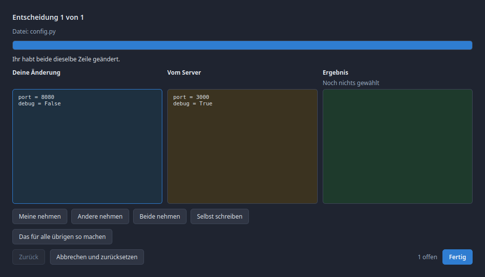

Der Assistent geht die Stellen einzeln durch:

- Kopf: „Entscheidung 2 von 5", Dateiname, Grund in Klartext
- Drei Spalten: **Deine Änderung**, **Vom Server**, **Ergebnis**
- Vier Buttons: **Meine nehmen**, **Andere nehmen**, **Beide nehmen**,
  **Selbst schreiben**
- **Das für alle übrigen so machen** als Abkürzung
- **Zurück** und **Weiter**, rechts die Zahl der offenen Entscheidungen

Bilder und andere Binärdateien lassen sich nicht Zeile für Zeile zusammenführen,
dort wählst du, welche Datei komplett bleibt. Hat eine Seite die Datei gelöscht
und die andere sie geändert, lautet die Frage „behalten oder löschen".

Geschrieben wird erst, wenn **alle** Entscheidungen getroffen sind.
**Abbrechen und zurücksetzen** stellt den Stand von vorher wieder her; deine
eigene gespeicherte Arbeit bleibt dabei unberührt.

## Branches und Server

Oben rechts im Projekt steht nur noch **Änderungen zum Server senden**, mit der
Anzahl, sobald etwas anliegt. Alles Übrige steht im Menü unter *Branch*: neuer
Branch, Branch wechseln, umbenennen, löschen, Server prüfen, Änderungen vom
Server holen, und die selteneren Fälle darunter. Auch dort steht die Anzahl am
Holen-Eintrag, sobald etwas anliegt.

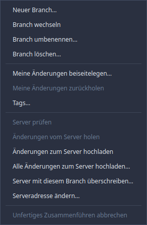

Ein Branchname wird geprüft, bevor Git ihn sieht. Aus „Fix login bug" macht
Branchly `fix-login-bug`.

Zum Wechseln muss der Arbeitsstand sauber sein, sonst wärest du dir selbst im
Weg. Speichere oder verwirf vorher.

### Anmeldung am Server

Git verwaltet seine Zugangsdaten selbst, über seinen Credential Helper. Ist dort
nichts hinterlegt, kann Git in einem Fenster ohne Terminal niemanden fragen und
bricht mit „Der Server hat die Anmeldung nicht akzeptiert" ab, obwohl überhaupt
keine Anmeldung geschickt wurde.

Für Projekte auf **GitHub über https** springt Branchly deshalb ein: liegt ein
Token im Schlüsselspeicher (Einstellungen → GitHub), benutzt Branchly es auch
zum Senden, Holen und Prüfen. Du musst dafür nichts einrichten.

Eng gefasst, und zwar mit Absicht:

| Fall | Was passiert |
|---|---|
| `https://github.com/...` und Token vorhanden | Branchly meldet sich mit dem Token an |
| `https://github.com/...` ohne Token | Meldung mit dem Hinweis, wo das Token hingehört |
| `git@github.com:...` (SSH) | Unverändert, dort zählt dein SSH-Schlüssel |
| GitLab, eigener Server, jede andere Adresse | Unverändert, Git regelt das mit seinem Helper |

Das Token wandert dabei nie in eine Datei, nie in die Repository-Konfiguration
und nie auf die Kommandozeile. Es lebt in der Umgebung genau des einen
Git-Prozesses, und die kann nur der eigene Benutzer lesen.

### Branch umbenennen und löschen

Beides steht im Menü unter *Branch*. Umbenannt wird immer der Branch, auf dem du
gerade stehst. Beim Löschen fragt Branchly, welcher weg soll, und bietet den
aktuellen gar nicht erst an, denn Git weigert sich, den Ast abzusägen, auf dem du
sitzt.

Liegen in einem Branch Commits, die es sonst nirgends gibt, fragt Branchly ein
zweites Mal und sagt dazu, dass sie endgültig weg sind. Erst dann wird gelöscht.

### Änderungen beiseitelegen

*Branch → Meine Änderungen beiseitelegen* räumt den Arbeitsstand weg und gibt dir
einen sauberen Ordner zurück, ohne dass du committen musst. Praktisch, wenn du
schnell auf einen anderen Branch wechseln willst. Eine Beschriftung ist optional
und hilft beim Wiedererkennen.

*Meine Änderungen zurückholen* legt sie wieder in den Arbeitsstand. Gibt es dabei
einen Konflikt, öffnet sich der Konflikt-Assistent wie sonst auch.

### Tags

*Branch → Tags* zeigt alle Namen, die in diesem Projekt an einen Stand geheftet
sind. Anlegen heftet den Namen an den Stand, den du gerade ausgecheckt hast.
Löschen entfernt ihn nur von diesem Rechner: ein Tag, der schon auf einem Server
liegt, bleibt dort, bis ihn dort jemand entfernt.

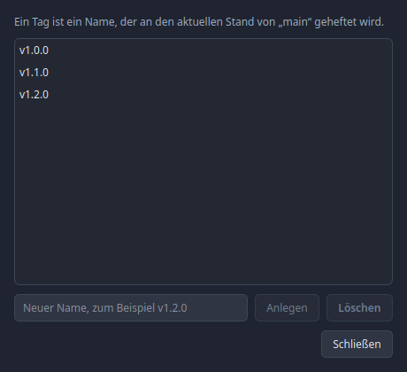

### Änderungen zurücksetzen

Zwei Wege, beide enden im selben Fenster:

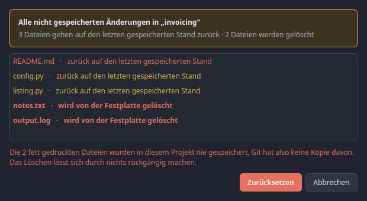

- **Rechtsklick auf ein Projekt** in der Liste links, dann *Alle Änderungen
  zurücksetzen*. Betrifft alles, was in diesem Projekt noch nicht gespeichert
  ist.
- **Rechtsklick auf eine oder mehrere Dateien** im Änderungsfenster, dann
  *Diese Datei zurücksetzen* bzw. *N Dateien zurücksetzen*. Mehrere Zeilen
  wählst du wie gewohnt mit Strg oder Umschalt aus.

Bevor etwas passiert, öffnet sich ein Fenster mit jeder einzelnen Datei und
daneben, was mit ihr geschieht. Zwei Fälle, die bewusst getrennt stehen:

| Anzeige | Bedeutung |
|---|---|
| zurück auf den letzten gespeicherten Stand | Die Datei bleibt, ihr Inhalt wird ersetzt |
| **wird von der Festplatte gelöscht** | Fett und rot. Git hat nie eine Kopie davon gehabt |

Der zweite Fall betrifft Dateien, die in diesem Projekt noch nie gespeichert
wurden, und ebenso solche, die nur für den nächsten Commit vorgemerkt sind.
Dort gibt es nichts, wohin die Datei zurückkehren könnte, sie verschwindet.
Deshalb steht das gesondert da und noch einmal als Satz darunter.

Erst ein Klick auf **Zurücksetzen** führt das aus. Voreingestellt ist
*Abbrechen*, damit eine versehentliche Eingabetaste keine Arbeit vernichtet.
Danach lässt sich hiervon nichts wiederherstellen, auch nicht über Git.

### Ein Projekt mit einem Online-Repository verbinden

Liegt ein Projekt bisher nur auf deinem Rechner, steht im Rechtsklickmenü der
Projektliste **Mit Online-Repository verbinden**. Hat es schon eine Adresse,
heißt der Eintrag stattdessen *Online-Repository ändern*.

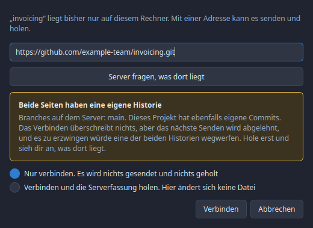

Branchly schlägt eine Adresse vor, abgeleitet aus dem Ordnernamen und dem Konto,
zu dem deine übrigen Projekte gehören. Für den Ordner `rechnungen` unter dem
Konto `beispiel-team` also `https://github.com/beispiel-team/rechnungen.git`.
Du kannst sie überschreiben.

**Server fragen, was dort liegt** sieht nach, bevor irgendetwas geschrieben wird.
Je nachdem, was gefunden wird, sagt Branchly etwas anderes:

| Lage | Was Branchly sagt |
|---|---|
| Das Repository ist leer | Es kann nichts überschrieben werden, dein erstes Senden füllt es |
| Dort liegt etwas, hier noch nichts | Die Serverfassung wird einfach zu deiner. Holen ist voreingestellt |
| Beide Seiten haben eigene Commits | Warnung mit Auswahl, siehe unten |
| Keine Antwort | Vielleicht gibt es das Repository noch nicht. Verbinden bleibt möglich |

Der letzte Fall ist der einzige, in dem wirklich etwas auf dem Spiel steht. Das
Verbinden selbst überschreibt nichts, es schreibt eine Zeile in die
Git-Konfiguration. Aber das nächste Senden wird abgelehnt, und es zu erzwingen
würde eine der beiden Historien wegwerfen. Deshalb hast du zwei Möglichkeiten:

- **Nur verbinden.** Es wird nichts gesendet und nichts geholt. Das ist
  voreingestellt.
- **Verbinden und die Serverfassung holen.** Geschrieben werden nur Verweise,
  keine Datei auf deiner Festplatte ändert sich. Danach kannst du dir ansehen,
  was dort liegt, und in Ruhe entscheiden.

### Serveradresse ändern

*Branch → Serveradresse ändern* setzt, wohin `origin` zeigt. Hat das Projekt noch
gar keinen Server, wird er damit angelegt.

### Server überschreiben

*Branch → Server mit diesem Branch überschreiben* ist die Notbremse für einen
Branch, an dem sonst niemand arbeitet, etwa nach einem Rebase. Branchly benutzt
dabei eine Sicherung: hat sich auf dem Server etwas bewegt, seit Branchly zuletzt
nachgesehen hat, wird nichts überschrieben und du bekommst Bescheid. Ein
Überschreiben ohne diese Sicherung bietet Branchly nicht an.

### Unfertiges Zusammenführen abbrechen

Steckt das Projekt mitten in einem Zusammenführen, einem Cherry-Pick oder einem
Revert, wird *Abbrechen* im Branch-Menü aktiv und setzt alles auf den Stand von
davor zurück.

### Einen neuen Branch das erste Mal senden

Ein frisch angelegter Branch steht nur auf deiner Festplatte. Beim ersten
**Änderungen zum Server senden** legt Branchly ihn dort an und merkt sich die
Zuordnung, sodass jedes weitere Senden ohne Nachfrage an dieselbe Stelle geht.
Du musst dafür nichts einstellen.

Stehst du auf keinem Branch, sondern siehst dir einen einzelnen gespeicherten
Stand an, sagt Branchly das und sendet nichts. Dort gibt es keinen Branch, den
der Server führen könnte. Wechsle erst auf einen Branch.

Lehnt der Server einen Push ab, heißt das fast immer: jemand anderes war
schneller. Erst holen, dann senden.

## GitHub

Der Reiter *GitHub* zeigt alles, was das ausgewählte Projekt auf dem Server hat,
und lässt es auch bearbeiten. Nur für Projekte auf GitHub und nur mit hinterlegtem
Zugriffstoken (Einstellungen → GitHub). Ohne Token oder bei GitLab und selbst
gehosteten Servern sagt das Panel das ausdrücklich, alles andere funktioniert
normal weiter.

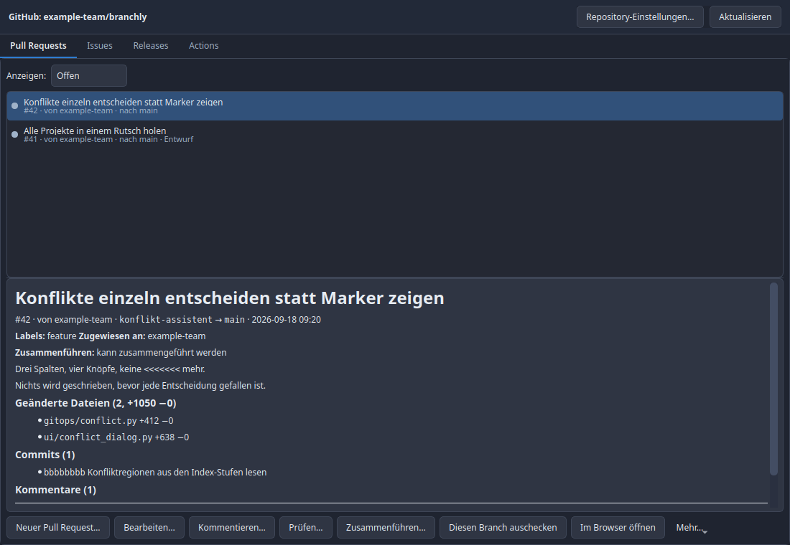

### Anmelden

In der Menüleiste unter *Konto* steht **Bei GitHub anmelden**. Darunter steht
immer, wer gerade angemeldet ist, und **Abmelden** entfernt das Token wieder vom
Rechner. Auf dem Server ändert sich dabei nichts. Denselben Knopf zeigt auch der
Reiter *GitHub*, solange niemand angemeldet ist.

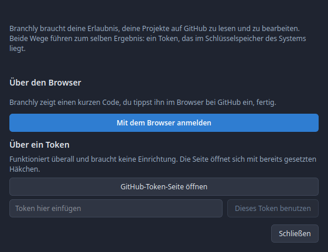

Zwei Wege, beide enden im selben Ergebnis, nämlich einem Token im
Schlüsselspeicher des Systems:

**Über den Browser.** Branchly zeigt einen kurzen Code und legt ihn in die
Zwischenablage, GitHub öffnet sich im Browser, du fügst den Code ein und
bestätigst. Fertig. Du hantierst dabei nie selbst mit einem Zugangsschlüssel, und
die Berechtigungen setzt Branchly, nicht du. Dieser Weg braucht eine registrierte
OAuth-App (siehe unten); ist keine eingetragen, sagt der Dialog das und der Knopf
bleibt aus.

**Über ein Token.** Funktioniert immer und braucht keine Einrichtung. Der Knopf
öffnet die GitHub-Seite mit bereits gesetzten Häkchen, du legst das Token an und
fügst es ein. Branchly fragt GitHub, wem es gehört, und speichert es nur, wenn
eine Antwort kommt. Ein Token, das nicht funktioniert, wird nicht abgelegt.

Mit der Anmeldung schaltet Branchly die GitHub-Funktionen ein, und das Token wird
ab dann auch zum Senden und Holen benutzt.

### Das Token

Ein Token legst du auf github.com unter *Settings → Developer settings →
Personal access tokens* an. Es landet im Schlüsselspeicher des Systems, nie in
einer Datei. Branchly prüft es sofort und zeigt, als wer du angemeldet bist.

Welche Berechtigungen es braucht, hängt davon ab, was du tun willst:

| Berechtigung | Wofür |
| --- | --- |
| `repo` | alles Lesen, Issues, Pull Requests, Releases, Einstellungen |
| `workflow` | Actions-Läufe neu starten, abbrechen, löschen |
| `delete_repo` | ein Repository löschen |
| `read:org` | Repositories in einer Organisation anlegen |

Fehlt eine Berechtigung, lehnt GitHub die Aktion ab und Branchly sagt, dass
vermutlich dem Token etwas fehlt. Ein fein granulares Token (*fine-grained*)
meldet seine Rechte nicht, dort lässt sich das vorher nicht prüfen.

### Pull Requests

Der Filter oben schaltet zwischen offenen, geschlossenen und allen. Die Auswahl
lädt darunter Beschreibung, Labels, Zuweisungen, Prüfungen und Kommentare.

Möglich sind: anlegen, Titel, Text und Zielbranch ändern, kommentieren, prüfen
(zustimmen, Änderungen anfordern, nur kommentieren), eine Prüfung bei jemandem
anfordern, zusammenführen, schließen, wieder öffnen, einen Entwurf freigeben oder
wieder zum Entwurf machen, und den Branch auschecken.

Die Detailansicht listet außerdem die geänderten Dateien mit ihren Zeilenzahlen
und die Commits des Pull Requests.

Beim Zusammenführen wählst du die Methode und kannst den Quellbranch gleich
danach löschen lassen. Angeboten werden nur die Methoden, die das Repository
erlaubt; eine abgeschaltete steht grau da und der Tooltip sagt, warum. Löscht das
Repository gemergte Branches ohnehin selbst, ist das Häkchen schon gesetzt. Branchly schickt dabei den Commit mit, den es zu
verschmelzen glaubt. Hat jemand in der Zwischenzeit gepusht, lehnt GitHub den
Merge ab, statt etwas anderes zusammenzuführen als das, was du gesehen hast.

Ein Entwurf lässt sich nicht zusammenführen. Der Knopf ist dann abgeschaltet und
der Tooltip sagt, warum.

### Issues

Wie bei den Pull Requests filtert der Knopf oben nach Zustand. Anlegen, Titel und
Text ändern, Labels, Zuweisungen und Meilenstein setzen, kommentieren, schließen
und wieder öffnen.

Beim Schließen unterscheidet Branchly die beiden Gründe, die GitHub kennt:
*erledigt* und *nicht geplant*. Der zweite steht im Menü „Mehr".

Unter „Mehr → Labels und Meilensteine…" lassen sich beide anlegen, umbenennen
und löschen. Ein gelöschtes Label verschwindet aus jedem Issue, das es trägt; ein
gelöschter Meilenstein lässt die Issues stehen und nimmt ihnen nur die Zuordnung.
Für einen abgeschlossenen Meilenstein ist *Schließen* meist das Richtige, denn
dann bleibt er in der Historie stehen.

### Releases

Anlegen mit Tag, Titel und Versionshinweisen, wahlweise als Entwurf oder als
Vorabversion, und auf Wunsch schreibt GitHub die Änderungsliste selbst. Bestehende
Releases lassen sich ändern und löschen, Dateien anhängen und wieder entfernen.

Ein gelöschtes Release nimmt sein Tag nicht mit. Das ist Absicht: ein Tag, das
jemand schon geholt hat, kommt durch Neuanlegen nicht zurück. Das Tag selbst
entfernst du über „Mehr → Tag löschen…".

„Mehr → Änderungsliste von GitHub holen…" lässt GitHub die Liste der Änderungen
seit dem vorherigen Tag schreiben und öffnet damit den Bearbeiten-Dialog, sodass
du sie noch anpassen kannst, bevor sie gespeichert wird.

### Actions

Die Läufe der Workflows, neuester zuerst, wahlweise nur für den aktuellen Branch.
Die Auswahl zeigt die einzelnen Jobs mit ihrem Ergebnis. Ein fertiger Lauf lässt
sich neu starten, wahlweise nur mit den fehlgeschlagenen Jobs, ein laufender
abbrechen, ein alter aus der Liste löschen.

Über „Mehr → Workflow starten…" lässt sich ein Workflow von Hand anstoßen. Das
geht nur bei Workflows, die `workflow_dispatch` deklarieren; bei allen anderen
lehnt GitHub es mit einer Begründung ab, die Branchly weiterreicht.

Die vollständigen Logs bleiben im Browser. Branchly zeigt pro Job das Ergebnis,
ein Log-Betrachter hätte ein ZIP-Archiv auspacken müssen und wäre ein eigenes
Fenster geworden.

### Repository-Einstellungen

Der Knopf *Repository-Einstellungen…* oben rechts öffnet Beschreibung, Website,
Themen, Standard-Branch, Sichtbarkeit, die Schalter für Issues, Wiki,
Projekt-Boards und Diskussionen, die erlaubten Merge-Methoden sowie das
Archivieren. Gesendet wird nur, was du wirklich geändert hast.

Im selben Dialog stehen die Personen mit Zugriff. Jemanden einladen geht mit
Kontoname und Zugriffsstufe (Lesen, Triage, Schreiben, Verwalten,
Administrieren), Zugriff entziehen mit Auswahl und Knopf. Eine Einladung wirkt
erst, wenn die eingeladene Person sie annimmt, deshalb taucht sie nicht sofort in
der Liste auf.

Branch-Schutzregeln sind bewusst nicht dabei: GitHub hat dafür inzwischen zwei
parallele Systeme (klassische Protection und Rulesets), und ein Dialog, der nur
eines davon kennt, richtet mehr Schaden an als er nützt.

Im selben Dialog liegt *Repository löschen…*. Das ist die einzige Aktion in
Branchly, die sich nicht rückgängig machen lässt, deshalb genügt dort kein Ja/Nein:
der vollständige Name muss eingetippt werden, genau wie auf github.com. Danach
fragt Branchly, ob auch die lokale Kopie aus der Projektliste verschwinden soll.
Der Ordner auf der Festplatte bleibt in jedem Fall liegen.

Darf das Konto die Einstellungen nicht ändern, öffnet sich der Dialog trotzdem,
zeigt aber alles gesperrt und sagt den Grund. Ein leerer Dialog oder ein Fehler
nach dem Speichern wäre die schlechtere Antwort.

### Umbenannte oder umgezogene Repositorys

Wird ein Repository auf GitHub umbenannt oder zu einem anderen Konto verschoben,
merkt Branchly das beim nächsten Öffnen des Projekts, wie GitHub Desktop auch.
GitHub leitet den alten Namen zwar eine Weile weiter, aber nur, bis jemand unter
dem alten Namen ein neues Repository anlegt. Deshalb wartet Branchly nicht darauf.

Was dabei passiert:

- Die Server-Adresse des Projekts wird auf den neuen Namen umgestellt, auf
  demselben Weg wie vorher: HTTPS bleibt HTTPS, SSH bleibt SSH.
- Eine eigene Push-Adresse wird mit umgestellt, wenn sie auf den alten Namen
  zeigte.
- Hieß das Projekt in der Projektliste wie das Repository, bekommt es den neuen
  Namen. Einen selbst vergebenen Namen behält es.
- Der Ordner auf der Festplatte behält seinen Namen, denn andere Programme,
  Terminals und Editoren zeigen vielleicht darauf.

Oben erscheint ein Hinweis mit altem und neuem Namen. Das Erkennen braucht die
Anmeldung bei GitHub, denn nur darüber sagt GitHub, wo ein Repository heute liegt.

### Neues Repository auf GitHub

*Projekt → Neues Repository auf GitHub…* legt eines an: Name, Beschreibung,
persönliches Konto oder Organisation, privat oder öffentlich, `.gitignore`-Vorlage
und Lizenz. Voreingestellt ist **privat**, denn ein versehentlich öffentliches
Repository lässt sich nicht ungesehen machen, der umgekehrte Fehler kostet einen
Klick.

Ist „Direkt nach dem Anlegen klonen" angehakt, öffnet sich danach der gewohnte
Klon-Dialog mit bereits eingetragener Adresse.

Ohne Anmeldung fragt Branchly zuerst, ob du dich bei GitHub anmelden willst. Nach
der Anmeldung geht es direkt mit dem Anlegen weiter.

### Ein vorhandenes Repository von GitHub klonen

Im Klon-Dialog steht neben dem Adressfeld *Von GitHub…*. Der Knopf lädt alle
Repositories, die dein Token sehen kann, mit Suche über Name und Beschreibung,
und trägt die Klon-Adresse des gewählten ein. Das ist die einzige Stelle, an der
das ganze Konto aufgelistet wird, und sie ist dort, weil „welches meiner
Repositories" genau beim Klonen die eigentliche Frage ist.

## Branchly aktuell halten

Beim Start fragt Branchly einmal am Tag bei GitHub nach, ob es eine neuere Version
von sich selbst gibt. Findet es eine, erscheint über den Panels ein Streifen:
**Installieren und neu starten** oder **Jetzt nicht**. Ohne Neuigkeit sagt es
nichts. Eine Meldung „alles beim Alten" braucht niemand.

„Jetzt nicht" heißt wirklich nur *jetzt* nicht: der Fund bleibt gemerkt, und beim
nächsten Start steht der Streifen wieder da, ohne dass dafür erneut jemand gefragt
werden muss. Weg ist er erst, wenn du das Update installiert hast.

Sofort nachfragen: **Hilfe → Nach Updates suchen…**. Dort steht, welcher Stand
installiert und welcher verfügbar ist, und unter **Was ist neu** alle Änderungen
seit deinem Stand, nicht nur die letzte. Sind es mehr als zehn, nennt die Liste am
Ende die Zahl der übrigen.

Ein eigener, noch nicht gepushter Commit im Branchly-Ordner ist **kein** Update.
Branchly vergleicht nicht bloß „gleicher Commit oder nicht", sondern fragt, ob der
Server wirklich etwas hat, was dir fehlt.

Beim Installieren holt Branchly die neue Version, schließt sich und startet
wieder. Was dabei **nicht** passiert:

- Deine Projekte, Einstellungen und dein Token werden nicht angefasst. Sie liegen
  außerhalb des Programmordners.
- Eigene, nicht eingecheckte Änderungen im Branchly-Ordner werden nicht
  überschrieben. Stattdessen bricht das Update ab und sagt genau das. Speichere
  sie erst als Änderung ein oder verwirf sie.
- Nichts wird ohne Klick installiert. Die Prüfung schaut nur.

Die Prüfung beim Start lässt sich in *Einstellungen → Automatische Prüfung*
abschalten. Wie oft sie höchstens läuft, steht als `update_check_hours` in
`settings.json`, wobei `0` „bei jedem Start" heißt.

## Einstellungen

| Reiter | Inhalt |
|---|---|
| Allgemein | Sprache, Standard-Sortierung, Fenster nach „Alle Projekte aktualisieren“ selbst schließen, Nachfragen vor Verlust |
| Automatische Prüfung | Intervall, ob dabei die Server gefragt werden, Update-Suche beim Start |
| Gegenüberstellung | Standardansicht, Abstände, Wort-Hervorhebung |
| GitHub | Token, GitHub-Funktionen ein/aus, Autorenbilder |

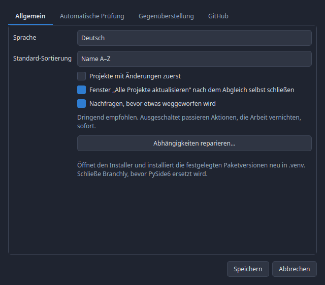

Ein Sprachwechsel greift beim nächsten Start.

### Hell oder dunkel

Das steht nicht in den Einstellungen, sondern in der Menüleiste unter
*Ansicht → Erscheinungsbild*. Dort stehen **Dunkel** und **Hell**, das aktive mit
einem Haken. Ein Klick genügt: das Fenster ist sofort umgefärbt, und die Wahl
wird gespeichert. Ein Schalter, dessen ganze Wirkung man sofort sieht, gehört
nicht hinter einen Dialog mit OK-Knopf.

## Wo liegen die Daten

| Was | Linux | Windows |
|---|---|---|
| Einstellungen | `~/.config/branchly/settings.json` | `%APPDATA%\branchly\settings.json` |
| Projektliste | `~/.config/branchly/repos.json` | `%APPDATA%\branchly\repos.json` |
| Autorenbilder | `~/.cache/branchly/avatars/` | `%LOCALAPPDATA%\branchly\cache\avatars\` |
| GitHub-Token | Schlüsselspeicher (libsecret) | Credential Manager |

Branchly speichert **keine** Git-Zugangsdaten. Das macht Gits eigener
Credential-Helper.

## Aufrufoptionen

```
branchly.sh [--language de|en] [--theme dark|light] [--repo PFAD] [--version]
```

`--language` und `--theme` gelten nur für diesen Start und überschreiben die
gespeicherte Einstellung nicht.
