# Branchly: Manual

This manual covers every feature, in the order you meet it in the program. No
prior knowledge of Git is assumed.

## When you are stuck

Rest the mouse on a button, a text field or a drop-down and wait a moment.
Almost everything in Branchly explains itself: what the control does, what it
does **not** do, and what to watch out for. The explanations are deliberately
sentences rather than a second copy of the label.

A greyed-out button says in its tooltip why it will not work right now, for
instance because no summary has been written yet, or because a pull request is
still a draft.

## The three areas

The **project list** on the left, **Changes / Graph / Pull requests** in the
middle, the **comparison** on the right. The dividers can be dragged; the
window's size and position are remembered when you quit.

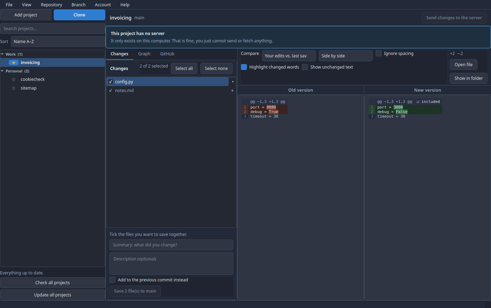

### Window size

The window goes down to about 930 pixels wide and keeps every control: rows of
buttons wrap onto a second line instead of running off the edge. That is not
only about comfort. A window whose minimum width exceeds the screen counts as
not resizable to the window manager, and it takes the maximise button away for
it.

Where minimise, maximise and close sit in the title bar, left or right, is up to
your desktop, not to Branchly. Under Cinnamon it is in *System settings →
Windows → Titlebar*.

### Greyed out means: not right now

A button that cannot do anything at this moment is pale and grey rather than
coloured. That holds everywhere, the prominent blue ones included: "Save to
main" without a summary looks like a button that is waiting, not like one that
is broken. The same goes for fetching and sending in a project with no server.
In those cases the tooltip says what is missing.

## Projects

### Adding and cloning

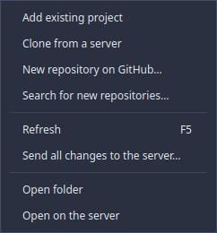

- **Add project** picks a folder that already holds a Git project. A subfolder
  is fine, Branchly finds the top of the project itself.
- **Clone** fetches a project from a server.

While you type an address, Branchly checks it:

| Message | Meaning |
|---|---|
| "This address cannot be used" | A typo. Expected is `https://…` or `git@server:user/project.git` |
| "This address is not safe" | It holds characters or options that would make Git do something other than what was asked. Branchly refuses it |
| "This folder is not empty" | Files are already in it. Cloning is still possible, see below |
| "This folder is already a Git project" | That would put a project inside a project. Use "Add project" |

**Cloning into a folder that already holds something:** everything there stays,
the project's files land beside it. If a file from the project had the same name
as one already present, Git stops and changes nothing. So you lose nothing, even
if you pick the wrong folder.

### Taking in a folder without Git

If you pick a folder under **Add project** that is not a Git project yet,
Branchly no longer stops there. It asks whether it should make one. Nothing in
the folder is changed: whatever is already there is listed as not yet saved and
waits for your first commit.

Straight afterwards Branchly asks for the address of the online repository, the
same dialog as in the section below. Cancel out of it and you are left with a
working local project you can connect at any time later.

### Finding every project at once

*Project → Search for new repositories…* walks a folder looking for Git projects
and lists what it finds. Everything not already in Branchly is **ticked**; untick
what you do not want and press *Add selected*.

On the very first start with an empty project list this search opens by itself,
because there is nothing else to look at anyway. After that it only comes from
the menu, even if you cancel out of it once.

Projects Branchly already knows are listed too, marked *already in Branchly* and
unticked. A list without them looks as if the search had missed projects that
are visible in the sidebar.

Three rules decide what is found:

- **A project that was found is not searched inside.** Otherwise submodules and
  bundled third-party projects would turn up as entries of their own.
- **Folders like `node_modules`, `.venv` or `.cache` are skipped.** No project of
  your own ever lives there, and they cost most of the time.
- **The search goes a few levels deep, not arbitrarily.** A repository twenty
  levels down is a copy, not a project.

The search only reads. Nothing on disk is created, moved or changed, and a folder
it may not read is passed over silently.

*File under* puts everything that gets added straight into a category.

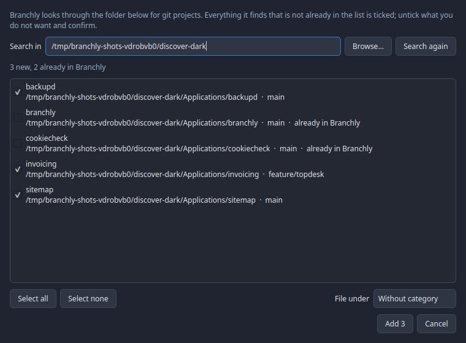

### Categories

Right-click the list or a category:

- **New category**
- **Move to category**, including one you create on the spot
- **Rename**, the projects come along
- **Remove**: the projects stay, they land under "Uncategorised"
- **Expand / collapse all**

Each category remembers whether it was open. A **search also shows hits inside
collapsed categories**, otherwise there would be no way to tell why a project
seems to be missing.

### Stars and sorting

The star to the left of the name pins a project to the top **within its
category**. That holds in every sort order, which is the point of it.

Sort orders: name A–Z, name Z–A, newest change first, recently opened first,
projects with changes first, your own order.

### The badges

| Badge | Meaning |
|---|---|
| `!` red | A conflict, a decision is missing |
| `●` yellow | Changed files in the project |
| `↓` blue | Something new on the server |
| `↑` yellow | Commits that have not been sent |
| `!` alone | The folder is gone |

Below the list is the summary across all projects, for instance "2 projects with
changes · 1 project with news from the server".

### What the tooltip tells you

Rest the mouse on a row and a small box appears with the two facts that do not
fit into the row:

| Line | Content |
|---|---|
| On the server | The repository's address on the server, or "No server connected" |
| Local copy | The folder's full path on this disk |

Underneath is when the project was last checked, or, for a folder that has
vanished, the note saying so. All of it applies to the whole row, not only to the
name.

## Checking what is new

Branchly brings itself up to date on its own in these cases:

| When | What |
| --- | --- |
| You give the window focus | The selected project is read again, with its file list, comparison and badges |
| You pick another project on the left | That project is read and checked |
| After the configured interval | Every project |
| Shortly after starting | Every project |

The focus case is the one that matters day to day: you change files in your
editor, click back onto Branchly, and what you see is what is on disk. Without it
you would have to refresh by hand every time.

So that this does not become a barrage, it happens at most every two seconds.
Jumping back and forth between editor and Branchly therefore does not start a
round on every jump. Walking down the project list with the arrow keys likewise
only checks the project you stop on, not every one on the way.

The GitHub data is **not** fetched again on a focus change. Those are network
requests against a rate limit, for data that changes in minutes rather than
seconds. The *Refresh* button in the GitHub tab is there for that.

By hand it still works like this:

- **Check all projects** at the bottom of the list, directly above *Update all
  projects*. Both live only there and not additionally in a menu
- **Check this project now** in the right-click menu
- **Automatically** in Settings → Automatic check: off, 5, 15, 30, 60 or 120
  minutes

The online check only asks the server which versions it has. It downloads nothing
and changes nothing in your project. To work entirely without a network, switch
"Ask the servers too" off; then only the local folders are looked at.

## Updating every project at once

**Update all projects** at the bottom of the list fetches each project's changes
from the server. The window starts at once, there is no second confirmation. It
shows the progress, and afterwards what became of **each** project separately.

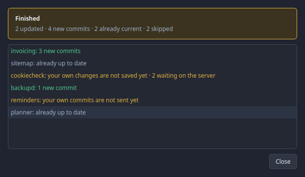

The run **only fast-forwards**. It merges nothing, overwrites nothing and cannot
leave a conflict behind. Anything that cannot be fast-forwarded unambiguously is
left untouched and named in the list:

| It says | It means |
|---|---|
| *3 new commits* | Fast-forwarded, the project is at the server's version |
| *already up to date* | The server had nothing new |
| *your own changes are not saved yet* | Unfinished work in the folder |
| *your own commits have not been sent* | The branch has diverged, fast-forwarding is impossible |
| *conflicts are waiting for a decision* | Walk through the conflict assistant first |
| *no branch selected* | Detached HEAD |
| *the branch follows no server branch* | No upstream set |
| *no server* | A purely local project |

Skipped projects are **fetched** all the same. That does not touch the folder,
but it does mean the badge afterwards says "3 waiting on the server" rather than
something stale. You then update such a project on its own through **Get changes
from the server**: there Branchly merges where needed and opens the conflict
assistant.

While the run is working the **Close** button waits: the run writes into the
folders, and a half-finished project with nobody watching would be the worse
option. Once everything is through, it closes the window.

## Sending every project at once

The counterpart is in the menu **Repository → Send all changes to the server…**.
It sends the commits in every project that are not on the server yet, in the same
window and also without a second confirmation.

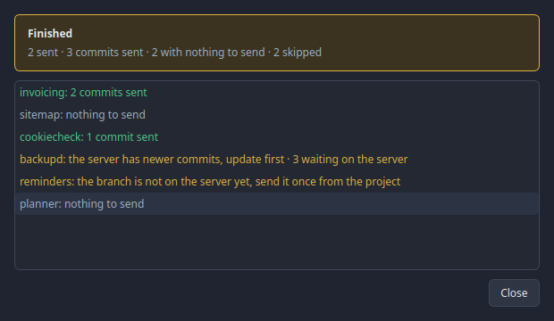

Only what can simply be sent is sent. Nothing is forced:

| It says | It means |
|---|---|
| *2 commits sent* | The server now has everything |
| *nothing to send* | There was nothing unsent |
| *the server has newer commits, update first* | Someone else sent something. Get it first, then send |
| *the branch is not on the server yet, send it once from the project* | A new branch is not published on the side |
| *conflicts waiting for a decision*, *no branch selected*, *no server* | As when updating |

Uncommitted changes in the folder are no obstacle, since commits are sent, not
files.

## Saving changes

1. Tick the files that belong together
2. Write a summary (required), a description is optional
3. **"Save n file(s) to \<branch\>"**

Summary, description and the *Add to the previous commit instead* tick belong to the project. Click
another project in between and everything is as you left it when you come back,
while the other project shows none of it. Branchly keeps this only while it runs.
After the commit the box is empty again.

Above the list is a single tick standing for all of them. It carries the count as
its own label, so the whole line is a click target, and its appearance says where
you are:

| Appearance | Meaning |
|---|---|
| Blue, ticked | All of it goes into the commit. This is how it starts |
| Amber, half filled | Something is out, either a whole file or a single block |
| Empty | Nothing is selected |

One click takes everything out, the next puts everything back. From the half
state a click means **all of it** again, including blocks you had taken out
individually. A tick that says something other than what the commit does would be
worse than none.

"Add to the last commit instead" attaches the selection to the previous commit
rather than creating a new one.

### Committing single blocks only

Sometimes one file holds two things that do not belong in the same commit. Above
every block in the comparison there is therefore a tick:

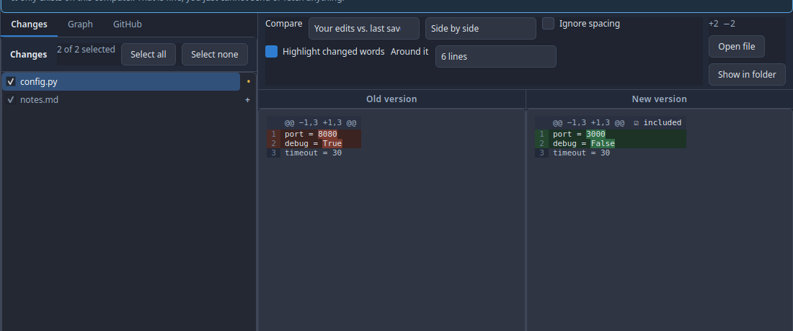

| Shown | Meaning |
|---|---|
| ☑ included | The block goes into the next commit |
| ☐ left out | The block stays behind, drawn pale |

Clicking the tick switches it. Take something out and the file's tick in the list
on the left goes half way, and Branchly commits exactly the blocks that are in.
What stays out is on your disk unchanged afterwards and turns up as a change
again.

Two limits, both deliberate:

- The ticks only exist for the comparison **Your edits vs. the last saved
  version**. Two commits against each other cannot be turned into a new commit.
- Clicking the file's own tick drops the block selection. A tick that says
  something other than what the commit does would be worse than none.

### The selection is remembered

New changes are always ticked. Untick one and Branchly remembers: after closing
and opening, the file is unticked again. Only what you unticked is remembered,
not what is ticked, because everything else is in anyway and a freshly changed
file should not have to be hunted for.

The memory also survives the file disappearing from the list in between, for
instance because you discarded the change and later touched the same file again.

As soon as a file has gone into a commit the matter is settled and Branchly
forgets it. A later, entirely different change to the same file is ticked again.

### What the list shows

At the right of every row is a mark saying what happened to the file, exactly as
in GitHub Desktop:

| Mark | Meaning |
| --- | --- |
| `+` | newly created, Git did not know it before |
| `•` | replaced, it already existed |
| `−` | deleted |
| `→` | renamed or moved |
| `!` | a conflict, it has to be decided first |

The row's colour says the same thing again, so it stays recognisable when the
marks are hard to tell apart.

### Right-click on a file

**Open file** (in your default program), **Show in folder**, **Copy path**,
**Ignore…**, **Revert**. Reverting asks first and cannot be undone.

### Ignoring

Under **Ignore…** there are up to three entries, depending on what you clicked:

| Entry | Writes to `.gitignore` |
| --- | --- |
| Only this file | `/path/to/file.txt` |
| All `*.log` files | `*.log` |
| The whole `build/` folder | `/build/` |

The entry for a single file gets a leading slash. Without it, `notes.txt` would
also match `docs/notes.txt`, and what was meant was the one line you clicked.
Special characters in the file name (`*`, `?`, `[`, a leading `#`) are escaped so
the entry matches exactly that file and no other.

`.gitignore` is created if it does not exist yet, otherwise the entry is appended
at the end. If the entry is already there, Branchly says so and writes nothing
twice.

A file that is already under version control does **not** disappear from the
list. `.gitignore` only applies to files Git does not know yet. The entry is
written all the same, so that it takes effect as soon as the file is taken out of
version control.

### Right-click on empty space

A right-click below the files, or on the note when a project has no changes at
all, opens a menu for the project as a whole:

- **Edit .gitignore…** opens the file in a window of its own
- **Open folder**
- **Refresh**
- **Revert all changes…**, greyed out when there is nothing to revert

The window shows `.gitignore` as text, one pattern per line. Comments, blank
lines and the order stay exactly as you type them, and a file written with
Windows line endings goes back with Windows line endings. If there is none yet,
*Save* creates it. Empty the field completely and the file is removed. *Save*
stays grey until you have changed something, and cancelling with unsaved
changes asks first.

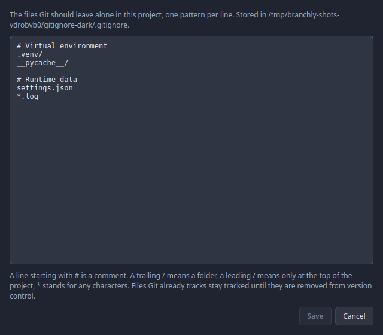

A `.gitignore` that cannot be read is shown locked and never overwritten.

New folders Git does not know yet are listed file by file, not as a single
entry. That is the only way each of them can be ticked, compared or ignored on
its own.

## The comparison

Two settings, independent of each other:


**Layout**: side by side or one column, "Ignore spacing", "Highlight changed
words", "Show unchanged text".

**Around it** is the drop-down deciding how much unchanged text is shown around
each change: 3, 6, 10, 20 or 50 lines, or **the whole file**. Six is the default.
Git itself shows three, which is enough to place a change and not enough to read
it in context.

That text is a quiet grey, readable but clearly held back, so that the change
itself stays the thing that stands out.

#### The change bar

With the whole file on screen, a narrow vertical bar appears between *Old
version* and *New version*. It stands for the **complete file**, top to bottom,
and marks every place where something changed:

| Colour | Meaning |
|---|---|
| Green | Something was added there |
| Red | Something was deleted there |
| Amber | Both, a line was replaced |

Clicking a mark jumps straight to that place, in both columns at once. In a file
of a thousand lines with three changes in it, there is nothing left to hunt for.
The pale frame inside the bar shows which part is on screen right now.

If you miss a mark, Branchly goes to the nearest one. A single changed line in a
long file is only a few pixels tall, and having to aim at that would be no help.

In the one-column layout the same bar sits to the right of the text.

With **side by side** there are two separate views: the old version on the left,
the new one on the right. Above each is a word saying which it is, "Old version"
and "New version". Without that label left and right can be mixed up, and then
every addition reads as a deletion. The label stays put while you scroll. Both
sides stay visible even when space runs short; neither disappears or is squeezed
away. Each side has its own horizontal scrollbar for long lines, and the two are
linked: whichever you use, both sides scroll, otherwise you would be comparing
two places that have nothing to do with each other. Vertically they scroll
together as well, so the lines stay level.

The divider between the two sides can be dragged when one side needs more room
than the other.

**Compare**: what is held against what:

| Choice | Compares |
|---|---|
| Your edits vs. the last saved version | The usual case |
| Your edits vs. what is ready to commit | What is not ticked yet |
| Ready to commit vs. the last saved version | What the next commit holds |
| Two selected versions | Mark two commits in the graph |
| Two branches | Two branches in full |

### Files without lines

Not every file is made of lines that can be compared. They are put side by side
all the same, because a new version is a change, and "this is not a text file"
says nothing about it.

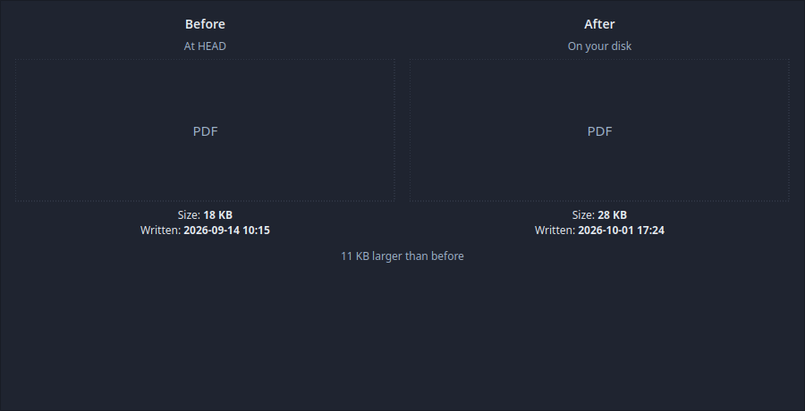

**Pictures** stand as before and after, both scaled down to the window if they
are too large.

**Everything else** gets a box with the file type instead of the picture, and
below it, on both sides, the two facts that exist for every file: **size** and
**when it was written**. Underneath, one sentence says what changed, for instance
"11 KB larger than before".

Where the date comes from depends on the side:

| Side | Size | Date |
| --- | --- | --- |
| On your disk | the real file size | when the file was last written |
| A commit | the size in the repository | the date of the commit that last changed the file |
| Ready to commit | the size in the index | when the file was written while being staged |

If a date cannot be established, a dash stands there. An invented date in a
comparison would be worse than none.

A side that does not exist says so explicitly: a file that was just created has
no "before", and that is information, not a gap.

Very large diffs are cut off, with a note. For a very large picture the preview
is left out, the size and the date are there all the same.

## The graph

Every line is a branch, every dot a saved version, the newest at the top. The
ring marks where you are standing. Branch and tag names are in brackets.

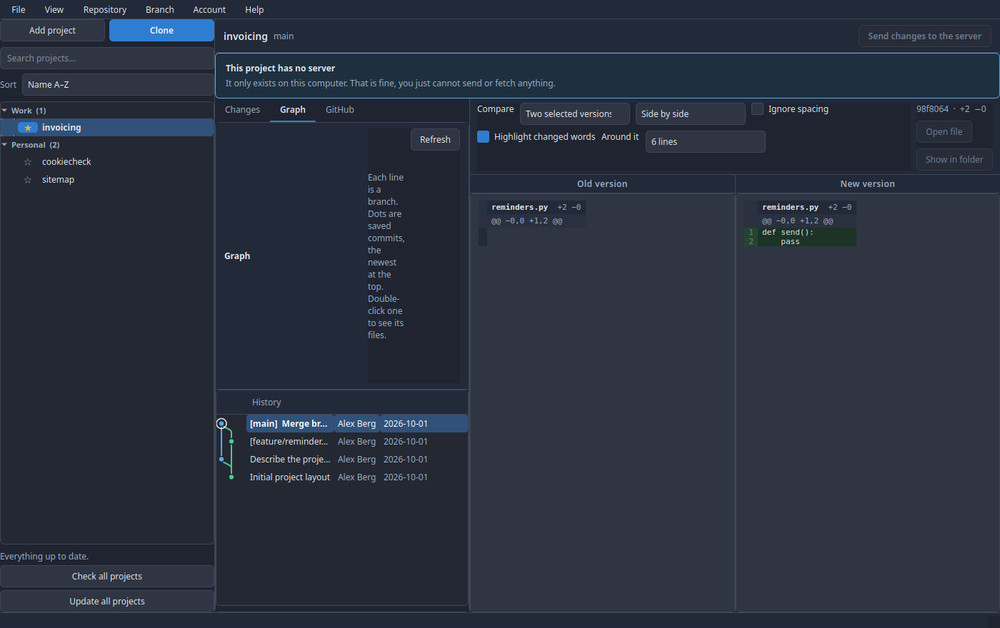

A click shows **everything that commit changed** on the right. Right-click:

| Action | Effect |
|---|---|
| Look at this version | Jumps to this version. Branchly explains beforehand that no branch is active then, and offers to create one instead |
| Start a new branch here | A new branch from this version |
| Merge into `<branch>` | Merge into the current branch |
| Apply this change to `<branch>` | Cherry-pick |
| Undo this change | A new commit that takes it back. The old one stays in the history |
| Move branch here… | Three variants: keep everything, keep the files, or **throw my work away** |
| Give this version a name | A tag |
| Copy the version id | The SHA to the clipboard |
| Mark for comparison | Then, on a second commit, "Compare with the marked version" |

"Move branch here and throw my work away" is the only action that destroys work
for good. It asks in plain words.

### Files of a version and old files

A **double click** on a version (or right-click, *Files of this version…*) opens
a window with every file that version changed. On the left is the list with
ticks, on the right the change of the file you are on.

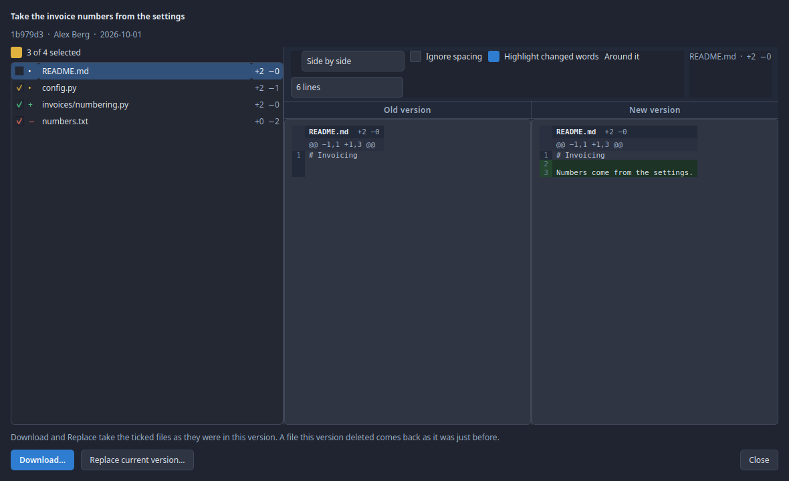

Every file starts ticked. The tick above the list works as under *Changes*: a
click ticks everything or nothing, half ticked means some are chosen. Below are
two actions, both for the ticked files:

| Action | Effect |
|---|---|
| **Download…** | Asks for a folder (*Downloads* the first time, the last one chosen after that) and creates a new folder `<project>-<version>` there, e.g. `invoicing-4dda86e`, with the project's subfolders. The project stays as it is. The strip at the top says where the files went, with **Open folder** |
| **Replace current version…** | Sets the files in the project folder to their state in this version, after asking |

Both take the file as it was **in this version**, that is after the commit. A
file this version deleted comes back as it was just before. Downloading the same
version again goes into `…-2`, the first download is left alone.

Before replacing, Branchly lists every file concerned:

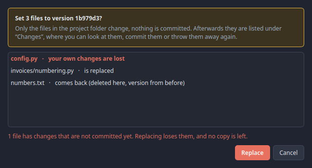

Files with **changes that are not committed yet** come first and in red: their
current content is not saved anywhere and is lost. The same goes for a file that
is on disk but not tracked by git.

Only the project folder changes, nothing is committed. Afterwards Branchly
switches to *Changes*, where the replaced files are listed like any other
change: look at them, commit them or throw them away again.

## Resolving conflicts

When fetching or merging changed the same places on both sides, a strip appears
at the top with **"Let's go"**.

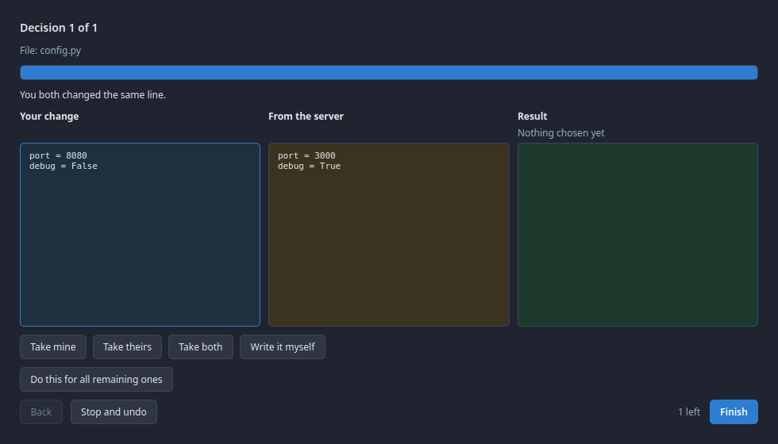

The assistant walks through the places one at a time:

- Header: "Decision 2 of 5", the file name, the reason in plain words
- Three columns: **Your change**, **From the server**, **Result**
- Four buttons: **Take mine**, **Take theirs**, **Take both**, **Write it myself**
- **Do this for all the rest** as a shortcut
- **Back** and **Next**, with the number of open decisions on the right

Pictures and other binary files cannot be merged line by line, so there you pick
which file stays whole. If one side deleted the file and the other changed it,
the question is "keep or delete".

Nothing is written until **every** decision has been made. **Cancel and reset**
puts the previous state back; your own saved work is untouched by it.

## Branches and the server

At the top right of the project there is now only **Send changes to the server**,
with the count as soon as something is waiting. Everything else is in the menu
under *Branch*: new branch, switch branch, rename, delete, check the server, get
changes from the server, and the rarer cases below. The count sits on the fetch
entry there too, as soon as something is waiting.

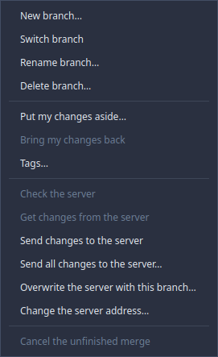

A branch name is checked before Git sees it. "Fix login bug" becomes
`fix-login-bug`.

To switch, the working tree has to be clean, otherwise you would be in your own
way. Save or discard first.

### Logging in to the server

Git manages its own credentials, through its credential helper. If nothing is
stored there, Git in a window without a terminal has nobody to ask and gives up
with "The server did not accept your login", although no login was sent at all.

For projects on **GitHub over https** Branchly therefore steps in: if a token is
in the keychain (Settings → GitHub), Branchly uses it for sending, fetching and
checking as well. You do not have to set anything up for that.

Narrowly drawn, and deliberately so:

| Case | What happens |
|---|---|
| `https://github.com/...` with a token stored | Branchly logs in with the token |
| `https://github.com/...` without a token | A message pointing at where the token goes |
| `git@github.com:...` (SSH) | Unchanged, your SSH key counts there |
| GitLab, your own server, any other address | Unchanged, Git sorts it out with its helper |

The token never goes into a file, never into the repository's configuration and
never onto a command line. It lives in the environment of exactly one Git
process, and only your own user can read that.

### Renaming and deleting a branch

Both are in the menu under *Branch*. What gets renamed is always the branch you
are standing on. For deleting, Branchly asks which one should go and does not
offer the current one at all, because Git refuses to saw off the branch you are
sitting on.

If a branch holds commits that exist nowhere else, Branchly asks a second time
and says that they will be gone for good. Only then does it delete.

### Putting changes aside

*Branch → Put my changes aside* clears the working tree and gives you a clean
folder back without having to commit. Useful when you want to switch branch
quickly. A label is optional and helps you recognise it later.

*Bring my changes back* puts them into the working tree again. If that produces a
conflict, the conflict assistant opens as it does elsewhere.

### Tags

*Branch → Tags* shows every name pinned to a version in this project. Creating
pins the name to the version you have checked out. Deleting removes it from this
computer only: a tag already on a server stays there until somebody removes it
there.

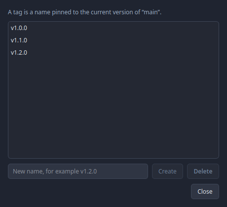

### Reverting changes

Two ways in, both ending in the same window:

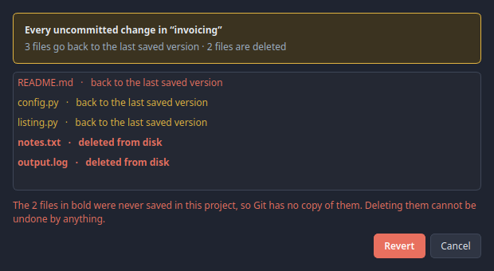

- **Right-click a project** in the list on the left, then *Revert all changes*.
  Covers everything in that project that is not saved yet.
- **Right-click one or more files** in the changes list, then *Revert this file*
  or *Revert N files*. Several rows are selected with Ctrl or Shift as usual.

Before anything happens, a window opens with every single file and, next to it,
what happens to it. Two cases kept apart on purpose:

| Shown | Meaning |
|---|---|
| back to the last saved version | The file stays, its content is replaced |
| **deleted from disk** | Bold and red. Git never held a copy of it |

The second case covers files that were never saved in this project, and equally
those only prepared for the next commit. There is nothing for the file to return
to, so it disappears. That is why it stands apart and is spelled out once more
underneath.

Only a click on **Revert** carries it out. *Cancel* is the default, so that a
stray Return key destroys no work. Nothing of this can be recovered afterwards,
not through Git either.

### Connecting a project to an online repository

If a project has so far only been on your computer, the project list's
right-click menu offers **Connect to an online repository**. If it already has an
address, the entry reads *Change the online repository* instead.

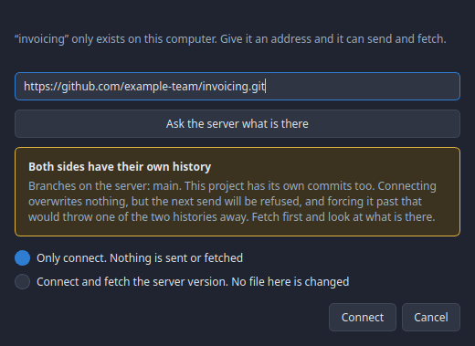

Branchly proposes an address, derived from the folder name and the account your
other projects belong to. For the folder `invoicing` under the account
`example-team`, that is `https://github.com/example-team/invoicing.git`. You can
type over it.

**Ask the server what is there** looks before anything at all is written. What
Branchly says depends on what it finds:

| Situation | What Branchly says |
|---|---|
| The repository is empty | Nothing can be overwritten, your first send fills it |
| Something there, nothing here | The server's version simply becomes yours. Fetching is preselected |
| Both sides have their own commits | A warning with a choice, see below |
| No answer | Perhaps the repository does not exist yet. Connecting stays possible |

The last case is the only one with anything really at stake. Connecting itself
overwrites nothing, it writes one line into the Git configuration. But the next
send will be refused, and forcing it past that would throw one of the two
histories away. So you have two options:

- **Only connect.** Nothing is sent and nothing is fetched. This is preselected.
- **Connect and fetch the server's version.** Only references are written, no
  file on your disk changes. Afterwards you can look at what is there and decide
  in your own time.

### Changing the server address

*Branch → Change the server address* sets where `origin` points. If the project
has no server at all yet, this creates one.

### Overwriting the server

*Branch → Overwrite the server with this branch* is the emergency brake for a
branch nobody else works on, for instance after a rebase. Branchly uses a safety
catch for it: if anything moved on the server since Branchly last looked, nothing
is overwritten and you are told. Overwriting without that catch is not offered.

### Cancelling an unfinished merge

If the project is stuck in the middle of a merge, a cherry-pick or a revert,
*Cancel* in the Branch menu becomes active and puts everything back the way it
was before.

### Sending a new branch for the first time

A freshly created branch is only on your disk. On the first **Send changes to the
server**, Branchly creates it there and remembers the pairing, so that every
further send goes to the same place without asking. You do not have to set
anything for that.

If you are not on a branch but looking at a single saved version, Branchly says
so and sends nothing. There is no branch there for the server to keep. Switch to
a branch first.

If the server refuses a push, it almost always means somebody else was faster.
Fetch first, then send.

## GitHub

The *GitHub* tab shows everything the selected project has on the server, and
lets it be edited too. Only for projects on GitHub and only with an access token
stored (Settings → GitHub). Without a token, or for GitLab and self-hosted
servers, the panel says so explicitly and everything else keeps working normally.

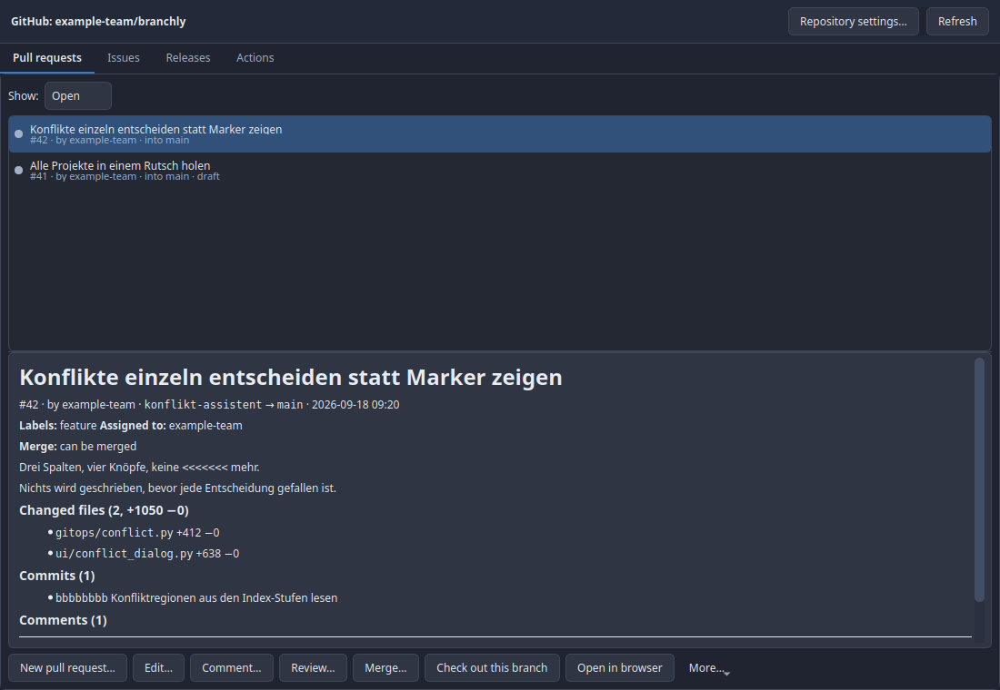

### Signing in

The menu bar has **Sign in to GitHub** under *Account*. Below it, it always says
who is signed in, and **Sign out** removes the token from the computer again.
Nothing changes on the server.

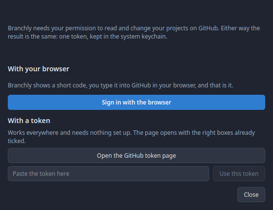

Two routes, both ending in the same result, a token in the system keychain:

**With the browser.** Branchly shows a short code and puts it on the clipboard,
GitHub opens in your browser, you paste the code and confirm. Done. You never
handle a credential yourself, and Branchly sets the permissions, not you. This
route needs a registered OAuth app (see below); if none is configured, the dialog
says so and the button stays off.

**With a token.** Works everywhere and needs no setup. The button opens the
GitHub page with the right boxes already ticked, you create the token and paste
it. Branchly asks GitHub who it belongs to and only stores it if an answer comes
back. A token that does not work is not kept.

Signing in switches the GitHub features on, and from then on the token is used
for sending and fetching as well.

### The token

You create a token on github.com under *Settings → Developer settings → Personal
access tokens*. It goes into the system keychain, never into a file. Branchly
checks it immediately and shows who you are signed in as.

Which permissions it needs depends on what you want to do:

| Permission | For |
| --- | --- |
| `repo` | reading everything, issues, pull requests, releases, settings |
| `workflow` | restarting, cancelling and deleting Actions runs |
| `delete_repo` | deleting a repository |
| `read:org` | creating repositories in an organisation |

If a permission is missing, GitHub refuses the action and Branchly says that the
token is probably short of something. A fine-grained token does not report its
rights, so there it cannot be checked in advance.

### Pull requests

The filter at the top switches between open, closed and all. Selecting one loads
its description, labels, assignees, checks and comments below.

Possible are: creating, changing the title, body and target branch, commenting,
reviewing (approve, request changes, comment only), requesting a review from
somebody, merging, closing, reopening, marking a draft as ready or turning it
back into a draft, and checking out the branch.

The detail view also lists the changed files with their line counts and the pull
request's commits.

When merging you pick the method and can have the source branch deleted straight
afterwards. Only the methods the repository allows are offered; a disabled one is
greyed out and the tooltip says why. If the repository deletes merged branches by
itself anyway, the box is already ticked. Branchly sends along the commit it
believes it is merging. If somebody pushed in the meantime, GitHub refuses the
merge rather than merging something other than what you saw.

A draft cannot be merged. The button is off then and the tooltip says why.

### Issues

As with pull requests, the button at the top filters by state. Creating, changing
title and body, setting labels, assignees and a milestone, commenting, closing
and reopening.

When closing, Branchly distinguishes the two reasons GitHub knows: *completed*
and *not planned*. The second one is in the "More" menu.

Under "More → Labels and milestones…" both can be created, renamed and deleted. A
deleted label disappears from every issue carrying it; a deleted milestone leaves
the issues standing and only takes their assignment away. For a finished
milestone *Close* is usually the right thing, because then it stays in the
history.

### Releases

Creating with a tag, a title and release notes, optionally as a draft or a
prerelease, and on request GitHub writes the list of changes itself. Existing
releases can be changed and deleted, files attached and removed again.

A deleted release does not take its tag with it. That is deliberate: a tag
somebody has already fetched does not come back by being recreated. You remove
the tag itself through "More → Delete tag…".

"More → Get the change list from GitHub…" has GitHub write the list of changes
since the previous tag and opens the edit dialog with it, so you can adjust it
before it is saved.

### Actions

The workflow runs, newest first, optionally only for the current branch.
Selecting one shows the individual jobs with their result. A finished run can be
restarted, optionally with only the failed jobs, a running one cancelled, an old
one deleted from the list.

Through "More → Start a workflow…" a workflow can be triggered by hand. That only
works for workflows declaring `workflow_dispatch`; for all others GitHub refuses
with a reason, which Branchly passes on.

The full logs stay in the browser. Branchly shows the result per job; a log
viewer would have had to unpack a ZIP archive and would have become a window of
its own.

### Repository settings

The *Repository settings…* button at the top right opens the description,
website, topics, default branch, visibility, the switches for issues, wiki,
project boards and discussions, the allowed merge methods, and archiving. Only
what you actually changed is sent.

The same dialog holds the people with access. Inviting somebody takes an account
name and an access level (read, triage, write, maintain, admin), withdrawing
access takes a selection and a button. An invitation only takes effect once the
invited person accepts it, which is why it does not appear in the list straight
away.

Branch protection rules are deliberately not there: GitHub now has two parallel
systems for it (classic protection and rulesets), and a dialog that knows only
one of them does more harm than good.

The same dialog holds *Delete repository…*. That is the one action in Branchly
that cannot be undone, so a yes/no is not enough there: the full name has to be
typed out, exactly as on github.com. Afterwards Branchly asks whether the local
copy should disappear from the project list too. The folder on disk stays in
either case.

If the account may not change the settings, the dialog still opens, but shows
everything locked and says why. An empty dialog, or an error after saving, would
be the worse answer.

### Renamed or moved repositories

When a repository is renamed on GitHub or moved to another account, Branchly
notices the next time the project is opened, as GitHub Desktop does. GitHub does
redirect the old name for a while, but only until somebody creates a new
repository under it. So Branchly does not wait for that.

What happens:

- The project's server address is moved to the new name, reached the same way
  as before: HTTPS stays HTTPS, SSH stays SSH.
- A separate push address moves as well when it pointed at the old name.
- If the project in the project list was called like the repository, it gets
  the new name. A name you chose yourself stays.
- The folder on disk keeps its name, since other programs, terminals and editors
  may point at it.

A note at the top names the old and the new name. Noticing needs you to be
signed in to GitHub, since only that way does GitHub say where a repository
lives today.

### A new repository on GitHub

*Project → New repository on GitHub…* creates one: name, description, personal
account or organisation, private or public, a `.gitignore` template and a
licence. The default is **private**, because a repository made public by mistake
cannot be made unseen, while the opposite mistake costs one click.

If "Clone straight after creating" is ticked, the usual clone dialog opens
afterwards with the address already filled in.

### Cloning an existing repository from GitHub

The clone dialog has *From GitHub…* next to the address field. The button loads
every repository your token can see, with a search across name and description,
and fills in the clone address of the one you pick. That is the only place where
the whole account is listed, and it is there because "which of my repositories"
is exactly the real question when cloning.

## Keeping Branchly up to date

On starting, Branchly asks GitHub once a day whether there is a newer version of
itself. If it finds one, a strip appears above the panels: **Install and restart**
or **Not now**. With no news it says nothing. Nobody needs a message saying
everything is as it was.

"Not now" really only means *now* not: the find is remembered, and on the next
start the strip is there again without anybody having to be asked afresh. It is
gone once you have installed the update.

To ask right away: **Help → Check for updates…**. It says which version is
installed and which is available, and under **What is new** every change since
your version, not only the last one. If there are more than ten, the list names
the number of the rest at the end.

A commit of your own in the Branchly folder that has not been pushed is **not**
an update. Branchly does not merely compare "same commit or not", it asks whether
the server really has something you are missing.

On installing, Branchly fetches the new version, closes and starts again. What
does **not** happen:

- Your projects, settings and token are not touched. They live outside the
  program folder.
- Your own uncommitted changes in the Branchly folder are not overwritten.
  Instead the update stops and says exactly that. Commit them or discard them
  first.
- Nothing is installed without a click. The check only looks.

The check on starting can be switched off in *Settings → Automatic check*. How
often it runs at most is `update_check_hours` in `settings.json`, where `0` means
"on every start".

## Settings

| Tab | Content |
|---|---|
| General | Language, default sort order, asking before anything is lost |
| Automatic check | Interval, whether the servers are asked, update check on start |
| Comparison | Default layout, spacing, word highlighting |
| GitHub | Token, GitHub features on/off, author pictures |

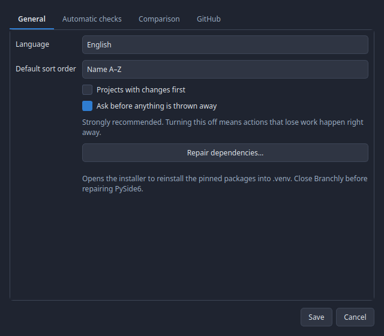

A change of language takes effect on the next start.

### Light or dark

This is not in the settings but in the menu bar under *View → Appearance*. There
are **Dark** and **Light**, the active one with a tick. One click is enough: the
window is recoloured immediately and the choice is stored. A switch whose entire
effect is visible at once does not belong behind a dialog with an OK button.

## Where the data lives

| What | Linux | Windows |
|---|---|---|
| Settings | `~/.config/branchly/settings.json` | `%APPDATA%\branchly\settings.json` |
| Project list | `~/.config/branchly/repos.json` | `%APPDATA%\branchly\repos.json` |
| Author pictures | `~/.cache/branchly/avatars/` | `%LOCALAPPDATA%\branchly\cache\avatars\` |
| GitHub token | Keychain (libsecret) | Credential Manager |

Branchly stores **no** Git credentials. Git's own credential helper does that.

## Command line options

```
branchly.sh [--language de|en] [--theme dark|light] [--repo PATH] [--version]
```

`--language` and `--theme` apply to that start only and do not overwrite the
stored setting.
